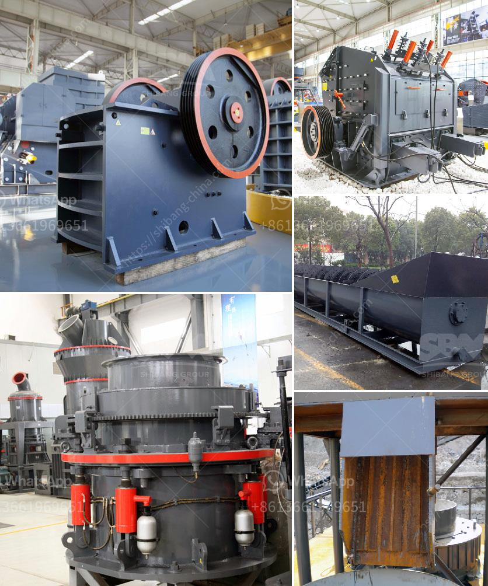

<h3>quarry crusher machines italy</h3>
In the mining industry, high-quality equipment is essential when it comes to crushing large stones and rocks into smaller sizes. The crushers you choose should feature a high-rated crushing capacity with minimal power consumption and provide a long service life. To ensure this, you need a reliable and reputable manufacturer that specializes in quarry crusher machines.

One such company that has been serving the mining industry for decades is based in Italy. This European nation has a long-standing heritage in producing heavy machinery and a strong reputation for manufacturing top-of-the-line quarry crusher machines.

The quarry crusher machines from Italy offer a high crushing capacity, a stable performance, and a reliable quality assurance, which allows them to be used safely in various fields. They are specifically designed to withstand the toughest working conditions and are suitable for crushing all types of stones and rock materials.

Italy's quarry crusher machines are widely used in mines, power plants, building materials, roads, railways, water conservancy, and chemical industries. Compared to the traditional crusher machines, the advanced machines from Italy feature an optimized design for higher efficiency and lower operating costs.

1. High Crushing Efficiency: The quarry crusher machines from Italy have a large crushing ratio, a uniform finished product size, and a high production capacity. This type of crusher machine performs well in both large-scale and small-scale construction projects.

2. Energy Efficiency: These machines are designed with advanced technology to reduce energy consumption during the crushing process. They are equipped with high-efficient motors that require less power to crush materials, resulting in lower operating costs and a smaller carbon footprint.

3. Durability and Reliability: Italian manufacturers prioritize the quality of their quarry crusher machines, ensuring they are made from robust materials that can withstand heavy-duty operations. The components are carefully selected to guarantee a long service life and a reduced risk of breakdowns, minimizing maintenance and repair costs.

4. Versatility and Adaptability: The quarry crusher machines from Italy can be customized to meet different processing requirements. They can handle a wide range of applications and materials, including limestone, granite, basalt, and other types of rocks. Their flexibility allows them to adapt to various working conditions, making them suitable for different projects.

Investing in quarry crusher machines from Italy is a wise choice for companies in the mining industry that operate in remote areas and need to crush materials on site. By purchasing these high-quality machines, organizations can streamline their operations and significantly improve their productivity.

In conclusion, quarry crusher machines from Italy offer a reliable and efficient solution for industries that need to crush heavy stones and rocks to create smaller, more manageable materials. These machines are designed to exceed industry standards, providing customers with a top-of-the-line investment that ensures optimal performance, longevity, and cost-effectiveness.
<h3>Contact us</h3><ul><li><strong>Whatsapp:&nbsp;<a href="https://wa.me/8613661969651">+8613661969651</a></strong></li><li><a href="https://swt.shibang-china.com/?git&amp;zhl&amp;quarry crusher machines italy"><strong>Online Service(chat now)</strong></a></li></ul><h3>Related</h3><ul><li><a href='talcum powder machine.md'>talcum powder machine</a></li><li><a href='calcium carbonate powder making equipment in germany.md'>calcium carbonate powder making equipment in germany</a></li><li><a href='used crusher for sale sell buy.md'>used crusher for sale sell buy</a></li><li><a href='how much is earned in the stone crusher.md'>how much is earned in the stone crusher</a></li><li><a href='crusher for sale in kerala.md'>crusher for sale in kerala</a></li></ul>