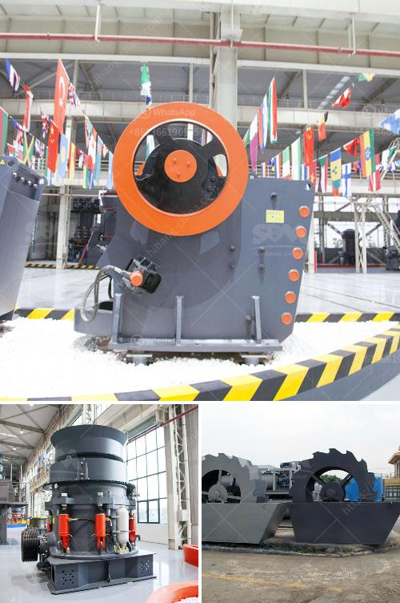

<h3>quarry crusher plant machinery</h3>
In any industrial or construction setting, extracting valuable minerals or materials is crucial for a successful project. That's where a quarry crusher plant comes in. With a range of crushing and screening equipment, quarry crusher plants help produce a variety of materials, from sand to gravel to rock.

The machinery involved in a quarry crusher plant includes the primary crusher, secondary crusher, and the vibrating screen. The primary crusher produces crushed coarse materials that are used as aggregate in construction projects. The secondary crusher further breaks down the materials into smaller size for easier processing. The vibrating screen ensures that the crushed materials are properly sorted and ready for further use.

What makes quarry crusher plants essential is their ability to crush and screen a wide range of materials efficiently. This versatility allows for the production of different grades and sizes of materials, which can be used in various applications. For example, crushed aggregate can be used in road construction, while sand and gravel are essential in the manufacturing of concrete.

Furthermore, quarry crusher plants are designed to be energy efficient and environmentally friendly. Modern machinery utilizes advanced technology, ensuring that the extraction process is as sustainable as possible. This includes the use of dust control systems and noise reduction measures to minimize the impact on the local environment and community.

Investing in quality quarry crusher plant machinery is an investment in the long-term success of any construction or industrial project. With the ability to produce a wide range of materials, these plants provide the necessary foundation for building and infrastructure development. Moreover, the efficient and eco-friendly operation ensures that the project is carried out in a socially responsible manner.

In conclusion, quarry crusher plants play a crucial role in the extraction and production of valuable minerals and materials. With their ability to crush and screen various materials efficiently, these plants contribute significantly to the success of construction projects. Investing in high-quality machinery ensures that the extraction process is sustainable, economically viable, and environmentally-friendly.
<h3>Contact us</h3><ul><li><strong>Whatsapp:&nbsp;<a href="https://wa.me/8613661969651">+8613661969651</a></strong></li><li><a href="https://swt.shibang-china.com/?git&amp;zhl&amp;quarry crusher plant machinery"><strong>Online Service(chat now)</strong></a></li></ul><h3>Related</h3><ul><li><a href='limestone crushing machine supplier.md'>limestone crushing machine supplier</a></li><li><a href='grinding raymond dolomite.md'>grinding raymond dolomite</a></li><li><a href='crusher stone prices peru.md'>crusher stone prices peru</a></li><li><a href='mini crusher hire johannesburg.md'>mini crusher hire johannesburg</a></li><li><a href='feasibility study for gypsum processing plant pdf.md'>feasibility study for gypsum processing plant pdf</a></li></ul>