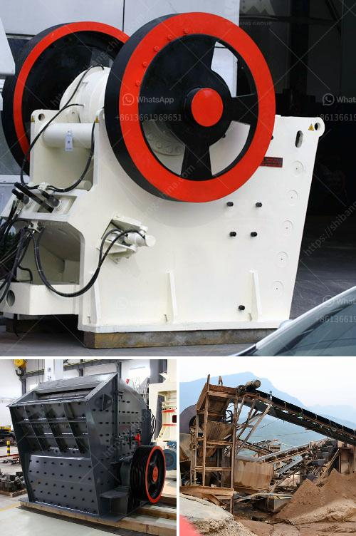

<h3>quarry equipment and crushers companies in japan</h3>
Quarry equipment and crushers companies in Japan play a crucial role in the development and production of various industries such as mining and construction. As a leading manufacturer and supplier of quarry equipment and crushers in Japan, they have contributed to the advancement of the mining machinery industry for over several decades. Their commitment to innovation, quality, and customer satisfaction has made them a preferred choice among companies looking for reliable quarry equipment and crushers.

One of the key factors that set these companies apart is their extensive range of products. They offer a wide variety of quarry equipment such as various-sized crushers, vibrating screens, conveyors, and feeders, all designed to meet specific needs and application requirements. These products are engineered to withstand even the toughest conditions and deliver exceptional performance, making them highly sought after by businesses operating in demanding environments.

Furthermore, the constant research and development efforts of these companies ensure that their quarry equipment and crushers are equipped with the latest technological advancements. They work closely with their customers to understand their unique needs and challenges, and strive to provide them with innovative solutions that improve productivity, efficiency, and safety. By incorporating state-of-the-art features and technologies into their products, these companies continue to push the boundaries of what is possible in the quarry equipment and crusher industry.

Another notable aspect of these companies is their commitment to sustainability. They recognize the importance of minimizing the environmental impact of their operations and products, and actively work towards reducing energy consumption, emissions, and waste. By utilizing advanced manufacturing techniques and materials, as well as investing in green technologies, they ensure their quarry equipment and crushers are not only efficient but also eco-friendly.

In conclusion, the quarry equipment and crushers companies in Japan strive to provide innovative solutions for the mining and construction industries. They offer a wide range of equipment and products that are engineered to meet the specific needs of their customers. With their commitment to quality, customer satisfaction, and sustainability, these companies continue to make a significant contribution to the advancement of the quarry equipment and crusher industry in Japan.
<h3>Contact us</h3><ul><li><strong>Whatsapp:&nbsp;<a href="https://wa.me/8613661969651">+8613661969651</a></strong></li><li><a href="https://swt.shibang-china.com/?git&amp;zhl&amp;quarry equipment and crushers companies in japan"><strong>Online Service(chat now)</strong></a></li></ul><h3>Related</h3><ul><li><a href='vibrating screens in italy.md'>vibrating screens in italy</a></li><li><a href='crusher manufacturer in pakistan.md'>crusher manufacturer in pakistan</a></li><li><a href='quick lime powder machine.md'>quick lime powder machine</a></li><li><a href='with conveyor price philippines.md'>with conveyor price philippines</a></li><li><a href='to 200 tph pe 750 1060 copper ore jaw crusher.md'>to 200 tph pe 750 1060 copper ore jaw crusher</a></li></ul>