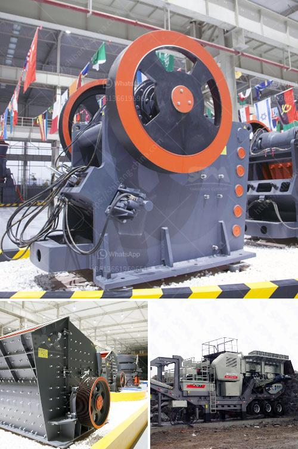

<h3>quarry machine in kenya</h3>
Quarry machines are essential equipment for any construction project. They are used to cut, shape, and craft hard stones such as granite, basalt, limestone, marble, and many more. Quarry machines in Kenya provide a wide range of innovative services to meet the demands of the ever-growing construction industry in Kenya.

Quarry machines cut and shape rocks into various sizes and shapes for the construction industry. Mining and quarrying are always tough and are essential for the booming construction industry in Kenya. Quarrying and mining are practical tasks that allow sustainable development of the natural resources available locally. The quarry machine is essential for quarrying and mining tasks, delivering high-quality results, and maximizing productivity.

One such crucial machine in the construction industry is the quarry machine. Quarry machines are small machines that carry out operations like drilling, cutting, and shaping rocks. Quarrying is a significant mining activity that entails excavating large amounts of rock material from the ground to find valuable minerals. The extracted stones are then crushed into smaller pieces using machines like jaw crushers, impact crushers, and cone crushers.

In Kenya, quarry machines are used in mining, construction, limestone, and granite quarrying. The quarry machine is essential for construction work such as road construction, village foundation, tunnel excavation, and new building construction. The quarry machine design ensures powerful drilling capability and high precision.

Kenya quarry machines can effectively process a variety of different rocks, including limestone, granite, marble, basalt, and more. These rocks can be used for various purposes such as road construction, building construction, and infrastructure development. Quarry machines in Kenya are a leading choice for both small and large-scale projects, with capabilities ranging from 1-1000 tons per hour.

Quarry machines in Kenya utilize cutting-edge technology to provide maximum productivity, precise operation, and durable performance. High-quality components such as engines, hydraulic systems, and automation features make quarry machines highly efficient. They are designed for durability, reliability, and easy maintenance.

The quarry machine in Kenya produces high-quality materials that meet the national and international construction standards. These materials include concrete aggregates, road bases, railway ballast, and crushed stones for building construction. Combined with modern technology and excellent craftsmanship, quarry machines in Kenya deliver outstanding results and contribute significantly to the construction industry's growth.

Quarry machines play a vital role in economic development in Kenya. They provide local employment opportunities, contribute to the country's GDP, and facilitate infrastructure development. By mining and processing rocks efficiently, quarry machines enable the construction industry to thrive, leading to economic growth and prosperity.

In conclusion, quarry machines in Kenya are essential equipment for mining and construction. They are used to shape, cut, and craft rocks into various sizes and shapes. Quarry machines in Kenya deliver high-quality results, maximize productivity, and contribute to sustainable development of the construction industry. These machines play a crucial role in the economic growth of Kenya, providing employment opportunities and supporting infrastructure development. With their advanced technology and operational efficiency, quarry machines are a reliable and indispensable tool for any construction project in Kenya.
<h3>Contact us</h3><ul><li><strong>Whatsapp:&nbsp;<a href="https://wa.me/8613661969651">+8613661969651</a></strong></li><li><a href="https://swt.shibang-china.com/?git&amp;zhl&amp;quarry machine in kenya"><strong>Online Service(chat now)</strong></a></li></ul><h3>Related</h3><ul><li><a href='crusher manufacturer in saudi.md'>crusher manufacturer in saudi</a></li><li><a href='200 ton crusher price.md'>200 ton crusher price</a></li><li><a href='cement plants in west bengal list.md'>cement plants in west bengal list</a></li><li><a href='3 stamp gold mill pictures.md'>3 stamp gold mill pictures</a></li><li><a href='grinding mill price in.md'>grinding mill price in</a></li></ul>