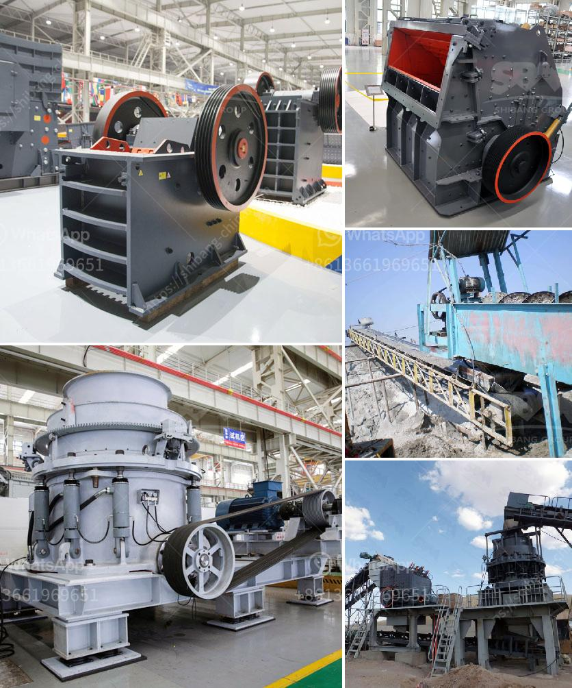

<h3>quarry machine manufacturing company in malaysia</h3>
Malaysia is a thriving country that is known for its rich reserves of various minerals. Quarrying is such a crucial industry that supports the nation's economy and infrastructure. Hence, it comes as no surprise that a quarry machine manufacturing company is an essential part of Malaysia's construction sector.

The quarry industry utilizes machines to extract raw materials from the earth, such as limestone, granite, and sand. These machines are crucial in enabling the extraction of vast amounts of materials used in various construction projects, ranging from buildings to roads and bridges. As such, the demand for high-quality quarry machines remains consistently high.

One notable quarry machine manufacturing company in Malaysia is XYZ Machinery Sdn Bhd. With years of experience and a robust portfolio, XYZ Machinery has firmly established itself as a leading player in the industry. The company focuses on manufacturing and supplying a wide range of quarry machines, including crushers, screeners, and conveyors, to meet the diverse needs of its valued customers.

One of the key strengths of XYZ Machinery lies in its commitment to quality. The company places great emphasis on using state-of-the-art technology and adhering to stringent manufacturing standards. This approach ensures that the quarry machines produced by XYZ Machinery are highly efficient, durable, and reliable. Such qualities are crucial for the machines to withstand the demanding operational conditions in quarries, where heavy materials are constantly processed.

In addition to quality, XYZ Machinery also prioritizes innovation. The company stays abreast of the latest technological advancements in the industry, constantly introducing new and improved models of quarry machines to meet the evolving needs of the market. By investing in research and development, XYZ Machinery ensures that its customers have access to cutting-edge equipment that enhances their productivity and operational efficiency.

Furthermore, XYZ Machinery understands the importance of providing excellent customer support. The company has established a dedicated after-sales service team to promptly address any technical issues or concerns that may arise. This commitment to customer service complements the high-quality products, providing customers with a holistic experience that fosters long-term partnerships.

XYZ Machinery's excellence in quarry machine manufacturing has not gone unnoticed. The company has received numerous accolades and certifications for its achievements in the industry. These accolades serve as a testament to XYZ Machinery's unwavering commitment to excellence, as recognized by both industry peers and regulatory bodies.

As the infrastructure development in Malaysia continues to grow, the demand for quarry machines is projected to rise steadily. XYZ Machinery is well-positioned to capitalize on this opportunity, owing to its strong reputation, high-quality products, and dedication to customer satisfaction. Through continuous innovation and a firm commitment to meeting industry demands, XYZ Machinery aims to remain at the forefront of the quarry machine manufacturing landscape in Malaysia.

In conclusion, the quarry machine manufacturing industry in Malaysia plays a vital role in supporting the country's construction and infrastructure development. Companies like XYZ Machinery embody the strengths of the sector, offering high-quality, innovative machines while providing exceptional customer support. As Malaysia's economy continues to evolve, the quarry machine manufacturing industry remains poised for sustained success, thanks to the consistent demand for its products in the construction sector.
<h3>Contact us</h3><ul><li><strong>Whatsapp:&nbsp;<a href="https://wa.me/8613661969651">+8613661969651</a></strong></li><li><a href="https://swt.shibang-china.com/?git&amp;zhl&amp;quarry machine manufacturing company in malaysia"><strong>Online Service(chat now)</strong></a></li></ul><h3>Related</h3><ul><li><a href='jaw crusher in uzbekistan.md'>jaw crusher in uzbekistan</a></li><li><a href='used crushing plant johannesburg.md'>used crushing plant johannesburg</a></li><li><a href='used stone crusher for sale germany.md'>used stone crusher for sale germany</a></li><li><a href='machinery needed for limestone extraction.md'>machinery needed for limestone extraction</a></li><li><a href='ball mill grinders cost.md'>ball mill grinders cost</a></li></ul>