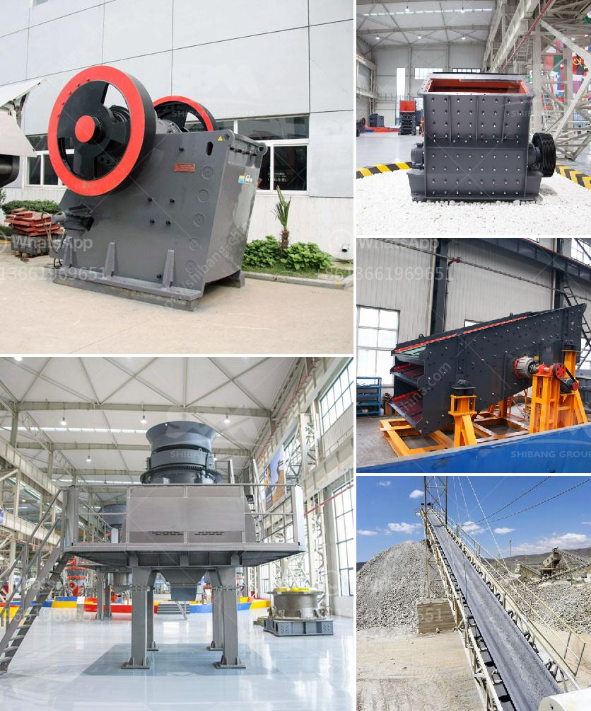

<h3>quarry plant equipment</h3>
Quarries are essential operations that help to extract valuable resources from the earth. However, the process of extracting materials such as limestone, granite, marble, and sandstone requires heavy-duty equipment. These quarries cannot function efficiently without the right equipment, making quarry plant equipment crucial for their operations.

Quarry plant equipment is designed to withstand the harsh working conditions in quarries. These rugged machines are capable of efficiently transforming large rocks into desired end-products. Let's delve into the various types of quarry plant equipment available and their significance in the quarrying process.

1. Crushers: Crushers are the heart of any quarry operation. They are used to extract raw materials from the earth and reduce their size for further processing. Various types of crushers, such as jaw crushers, impact crushers, and cone crushers, are employed in quarries to break down large rocks into smaller, more manageable pieces.

2. Screens: Screens are used to separate the different sizes of crushed materials. They ensure the quality and consistency of the final products by removing unwanted particles. Vibrating screens are commonly used in quarries to classify materials based on their size.

3. Conveyors: Conveyors play a crucial role in transporting materials within the quarry. They are used to carry raw materials from the extraction point to the primary crusher and then from the crusher to stockpiles or further processing facilities. Conveyors increase the efficiency of the quarrying process by minimizing the need for manual labor and reducing the time and effort required to transport materials.

4. Loaders: Loaders are heavy-duty machines used to load large quantities of materials into trucks, stockpiles, or crushers. They are commonly used in quarries to facilitate the movement of materials and ensure a continuous flow of production. Loaders are equipped with powerful buckets that can carry substantial amounts of extracted materials.

5. Drills: Drills are used to create blast holes in the quarrying process. They are essential for blasting and breaking down large rock formations. Drills come in various sizes and types, including rotary drills, top hammer drills, and down-the-hole drills, each with its unique application.

6. Dust Suppression Systems: Dust is a common problem in quarries due to the abrasive processes involved in material extraction and processing. Dust suppression systems help to control and minimize the spread of dust, improving air quality and ensuring a safe working environment for quarry workers.

The use of modern quarry plant equipment has revolutionized the extraction and processing of materials. It has significantly improved productivity and efficiency while reducing labor requirements and operational costs. Investing in high-quality and reliable quarry plant equipment is, therefore, crucial for quarry operators looking to streamline their operations and maximize their profits.

In conclusion, quarry plant equipment is essential for the successful operation of quarries. Machinery such as crushers, screens, conveyors, loaders, drills, and dust suppression systems all play a vital role in extracting and processing materials efficiently. Investing in reliable and durable equipment will not only optimize quarry operations but also contribute to the sustainable development of the industry.
<h3>Contact us</h3><ul><li><strong>Whatsapp:&nbsp;<a href="https://wa.me/8613661969651">+8613661969651</a></strong></li><li><a href="https://swt.shibang-china.com/?git&amp;zhl&amp;quarry plant equipment"><strong>Online Service(chat now)</strong></a></li></ul><h3>Related</h3><ul><li><a href='counties roller mills.md'>counties roller mills</a></li><li><a href='used crushing plant johannesburg.md'>used crushing plant johannesburg</a></li><li><a href='closed quarrz plants in kenya.md'>closed quarrz plants in kenya</a></li><li><a href='stone crusher machine price list in kenya.md'>stone crusher machine price list in kenya</a></li><li><a href='price of stone crusher stone crusher.md'>price of stone crusher stone crusher</a></li></ul>