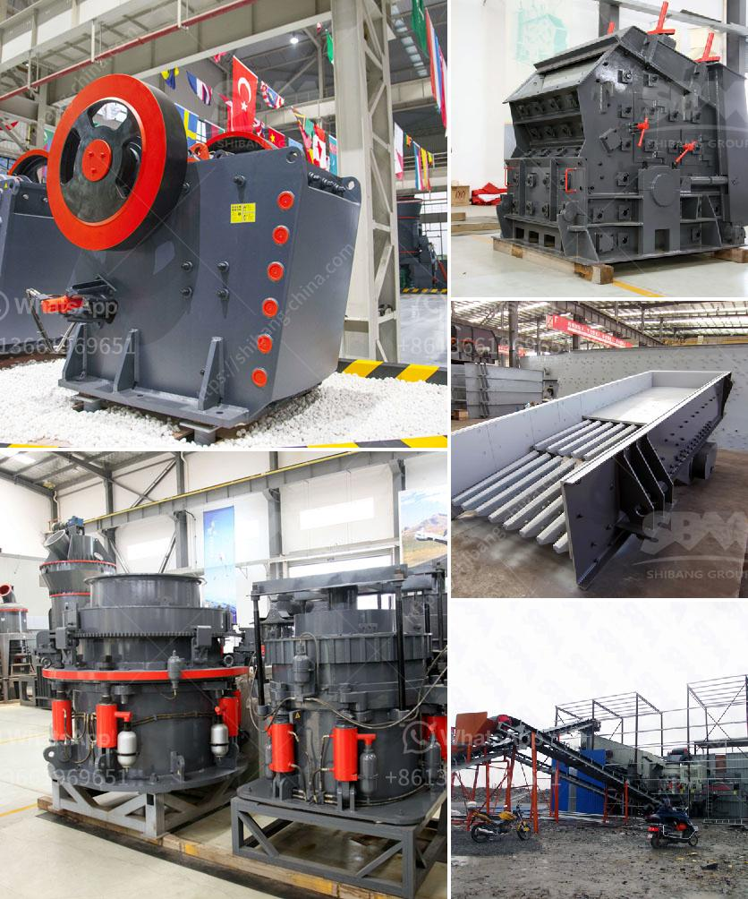

<h3>quarry stone crusher for sale in south africa</h3>
2020 has been the most challenging year in recent memory for various industries around the world, including the construction industry. With the ongoing Covid-19 pandemic, the construction industry has been heavily impacted. However, the quarrying of stones for construction purposes continues to thrive, and it is one of the few industries that has been able to sustain itself during these trying times. South Africa, in particular, has a massive mining industry – it is a major source of diamonds, gold, platinum and coal, and is home to most of the deepest mines in the world.

With a plethora of coal, gold, and diamond reserves, it is no surprise that South Africa has become one of the world leaders when it comes to quarrying and mining. However, the recent pandemic has caused a slump in the construction industry, resulting in a decrease in demand for quarrying equipment. But as the industry slowly recovers, there is a growing demand for stone crushers, especially in South Africa, where construction projects are on the rise.

For most construction projects, quarries play a vital role in providing the necessary materials. In South Africa, quarries produce aggregates used in road construction, concrete production, asphalt, and other construction materials. The production of these aggregates requires blasting, drilling, and crushing the stones in specialized equipment.

A quarry stone crusher can be used for a number of different purposes, including landscaping and decorative stone production. In addition to its durability and cost-effectiveness, quarry stone crusher is characterized by its high output and high investment return.

With a continual need to increase efficiency and reduce operating costs, quarry owners have looked upon haulage as an area where cost reductions can be made. The stone quarrying industry has been the traditional supplier of construction materials for centuries, and is still laying the foundations for the future. Using a stone quarry crusher machine is a highly effective way to improve productivity while reducing costs.

The quarry stone crusher is designed for the Kenya investors, the characteristics of the quarry stone crusher are as follows:

1. The fixed stone crusher is flexible and practical. It allows the user to solve problems related to small scale quarry stone crushing process and is suitable for many scenarios such as field work, urban infrastructure construction, road construction and so on.

2. The entire crushing process of quarry stone crusher is mainly composed of the core part – the crushing chamber, the eccentric shaft rotation system, the crushing quiet.

As the need for more durable construction materials increases, the importance of quarry stone crushers is growing. Therefore, investing in a quarry stone crusher for sale is a good choice for you. This not only improves the overall efficiency of the quarry operation but also saves you money by reducing operational costs. In addition, it also ensures that construction projects are completed on time and within budget, which is crucial in the competitive construction industry. With the steady growth of the construction industry in South Africa, there is a high demand for stone crushers, and this has led to a continuous increase in quarrying activities. As a result, the quarry stone crusher for sale in South Africa is facing various challenges, especially the high risk associated with crushing large pieces of stones while working on the construction sites. Addressing these challenges has become crucial for improving the overall efficiency, profitability, and reliability of the stone quarrying process in South Africa.
<h3>Contact us</h3><ul><li><strong>Whatsapp:&nbsp;<a href="https://wa.me/8613661969651">+8613661969651</a></strong></li><li><a href="https://swt.shibang-china.com/?git&amp;zhl&amp;quarry stone crusher for sale in south africa"><strong>Online Service(chat now)</strong></a></li></ul><h3>Related</h3><ul><li><a href='calcium carbonate powder crushing crusher usa.md'>calcium carbonate powder crushing crusher usa</a></li><li><a href='vertical roller mill for cement grinding.md'>vertical roller mill for cement grinding</a></li><li><a href='used ball mills in india.md'>used ball mills in india</a></li><li><a href='gravel jaw crusher.md'>gravel jaw crusher</a></li><li><a href='vibrating screen efficiency.md'>vibrating screen efficiency</a></li></ul>