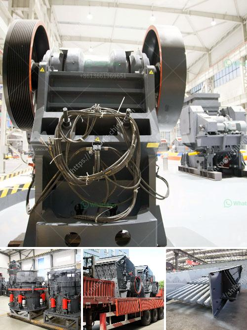

<h3>quarrying crusher machines</h3>
Quarrying is a process of extracting stones, rocks or other materials from the Earth's surface. The machinery used in this process is called a quarrying crusher machine. It plays a vital role in the efficiency and productivity of quarrying activities.

A quarrying crusher machine is responsible for breaking down large rocks into smaller pieces. It takes large rocks and reduces them to small sizes, making it easier to transport and use for various construction purposes. These machines are equipped with powerful jaws or hammers that crush the rocks with great force.

One of the primary benefits of using quarrying crusher machines is that it saves time and effort. Manual breaking and crushing of rocks is a time-consuming and labor-intensive process. However, with the help of quarrying crusher machines, this process becomes much more efficient. It reduces the need for manual labor and ensures a faster and more effective crushing process.

Another advantage of using quarrying crusher machines is the reduction in waste materials. The process of quarrying often leaves behind a significant amount of waste rock, which is often discarded or used as fillers. However, with the use of crusher machines, this waste can be crushed and reused in various ways. The crushed rock can be used for making concrete, road base, or even as landscaping material, thus reducing the need for additional raw materials and minimizing waste.

In addition to these benefits, quarrying crusher machines are also designed to be environmentally friendly. They are equipped with filters and dust suppression systems that prevent the release of harmful dust particles into the air. This helps in maintaining cleaner air quality in and around the quarrying site, reducing the risk of health hazards for workers and nearby residents.

Overall, quarrying crusher machines are indispensable in the quarrying industry. They provide a cost-effective and efficient solution for breaking down rocks and extracting valuable materials. Their use not only saves time and effort but also promotes sustainability by reducing waste and environmental impact.
<h3>Contact us</h3><ul><li><strong>Whatsapp:&nbsp;<a href="https://wa.me/8613661969651">+8613661969651</a></strong></li><li><a href="https://swt.shibang-china.com/?git&amp;zhl&amp;quarrying crusher machines"><strong>Online Service(chat now)</strong></a></li></ul><h3>Related</h3><ul><li><a href='crusher grinder and sieving equipment kaolin.md'>crusher grinder and sieving equipment kaolin</a></li><li><a href='stone crusher plant pakistan feasibility report.md'>stone crusher plant pakistan feasibility report</a></li><li><a href='raymond hammer mill.md'>raymond hammer mill</a></li><li><a href='roller mill sahibabad.md'>roller mill sahibabad</a></li><li><a href='mobile crushing equipment for sale.md'>mobile crushing equipment for sale</a></li></ul>