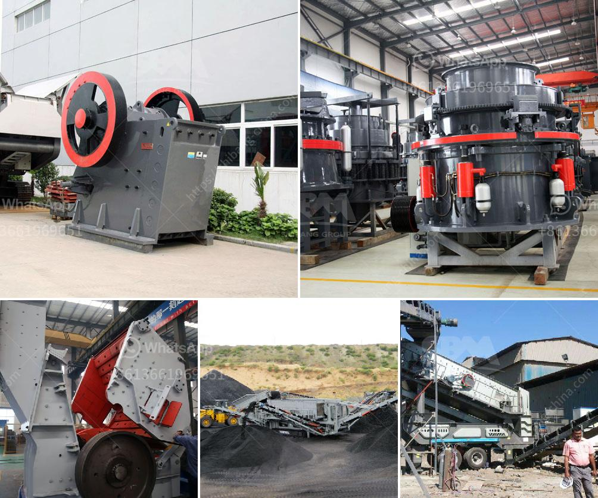

<h3>quartz crusher for crushing</h3>
Quartz is one of the most abundant minerals on Earth, and it has a wide range of applications in various industries. To harness its potential, the quartz needs to be crushed into smaller sizes that can be used for different purposes. This is where a quartz crusher comes into play.

A quartz crusher is a machine that is used to crush quartz into smaller sizes. The usage of quartz crusher varies depending on the type and model of the crusher. As mentioned above, quartz crusher can be used for primary crushing or secondary crushing.

Quartz crushing can be processed in three steps according to end products requirements: primary crushing, secondary crushing, and tertiary crushing. The feeder or screens separate large boulders from finer rocks that do not require primary crushing, thus reducing the load to the primary crusher. Jaw crusher, impact crusher, or gyratory crushers are usually used for initial reduction.

The primary crushed materials are further crushed in the secondary and tertiary crushers. The fines and the coarse material are separated by asthmatic scrubbers and screens. The final size of quartz chips processed by quartz crusher ranges from 0.03mm to 6.35mm.

Quartz countertops have gained popularity in recent years, and this has led to an increased demand for quartz chips. These chips are used in a wide range of applications, including kitchen countertops, bathroom vanities, backsplashes, and flooring. The durability and aesthetics of quartz make it a preferred choice for homeowners and designers.

Not only is quartz used in countertops, but it is also used in construction materials such as concrete, asphalt, and brick. It is known for its high resistance to wear, mechanical stress, and chemical agents, making it ideal for such applications.

In conclusion, a quartz crusher plays a crucial role in the quartz crushing process. It is used to crush quartz into smaller sizes that can be used in various industries, including countertops, construction materials, and more. With the increasing demand for quartz products, the need for reliable and efficient quartz crushers has also grown. By choosing the right crusher model and utilizing it properly, manufacturers can ensure the high-quality production of quartz chips, meeting the requirements of various industries.
<h3>Contact us</h3><ul><li><strong>Whatsapp:&nbsp;<a href="https://wa.me/8613661969651">+8613661969651</a></strong></li><li><a href="https://swt.shibang-china.com/?git&amp;zhl&amp;quartz crusher for crushing"><strong>Online Service(chat now)</strong></a></li></ul><h3>Related</h3><ul><li><a href='hammer mill price in nigeria.md'>hammer mill price in nigeria</a></li><li><a href='mobile crusher track.md'>mobile crusher track</a></li><li><a href='gold crusher and mill.md'>gold crusher and mill</a></li><li><a href='stone crusher machine plant for sale in pakistan.md'>stone crusher machine plant for sale in pakistan</a></li><li><a href='crush machine price in pakistan.md'>crush machine price in pakistan</a></li></ul>