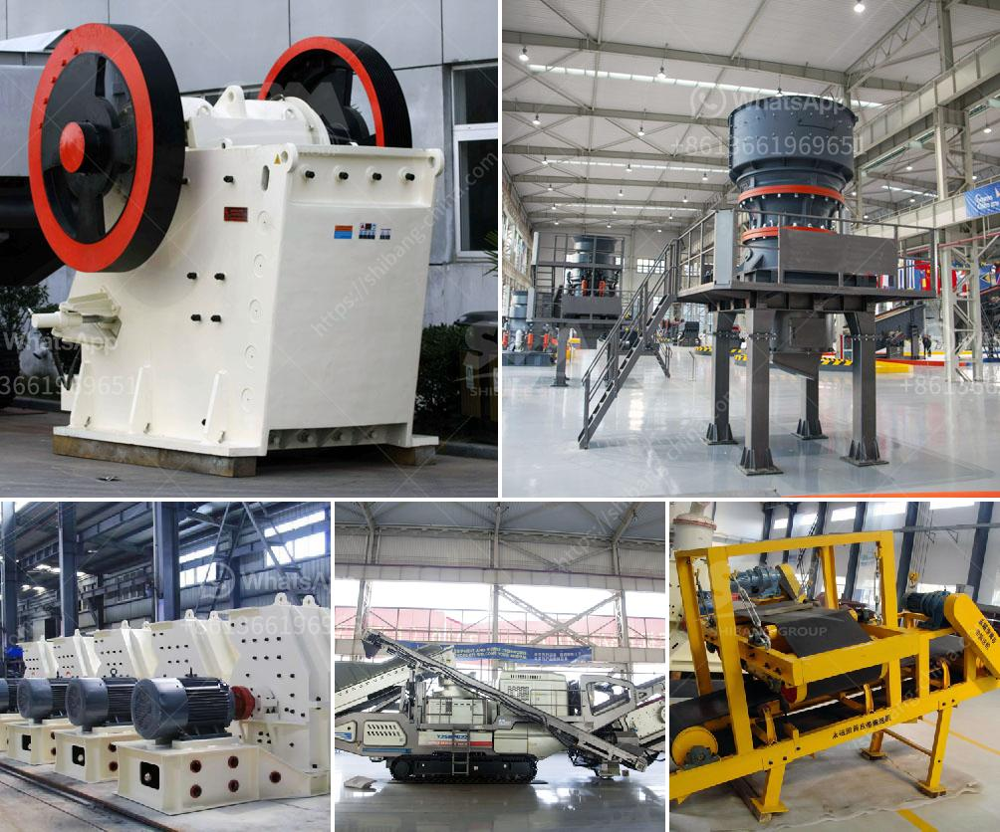

<h3>quartz crusher manufacturing process</h3>
Quartz is a mineral that is commonly found in rocks. It is known for its durability and aesthetic appeal, making it a popular choice for countertops, tiles, and other decorative applications. However, before it can be used in these products, the quartz must go through a manufacturing process to become the desired size and shape.

The first step in the quartz crusher manufacturing process is the excavation of raw quartz. This process can be done through blasting, drilling, or digging. Once the quartz is extracted, it is then transported to a crusher where it is broken down into smaller pieces.

The crusher machine uses a series of jaws or hammers to crush the quartz into smaller pieces. This process is repeated multiple times until the desired size is achieved. After the crushing process, the quartz is then screened to remove any impurities or unwanted materials.

Next, the crushed quartz is mixed with a binder to create a slurry. This slurry is then poured into a mold and left to dry and harden. The mold can be customized to create different shapes and sizes of quartz products.

Once the quartz has hardened, it undergoes a polishing process to enhance its appearance and smoothness. This process involves grinding the surface of the quartz using various abrasive materials until it achieves the desired finish.

After the polishing process, the final step is quality control. The quartz products are inspected to ensure they meet the required specifications and standards. Any defects or imperfections are corrected or discarded.

In conclusion, the manufacturing process of quartz crushers involves excavation, crushing, screening, molding, polishing, and quality control. This process ensures that the quartz products are of high quality and suitable for various applications.
<h3>Contact us</h3><ul><li><strong>Whatsapp:&nbsp;<a href="https://wa.me/8613661969651">+8613661969651</a></strong></li><li><a href="https://swt.shibang-china.com/?git&amp;zhl&amp;quartz crusher manufacturing process"><strong>Online Service(chat now)</strong></a></li></ul><h3>Related</h3><ul><li><a href='cost of stone crusher in kenya.md'>cost of stone crusher in kenya</a></li><li><a href='dry process for gold recovery.md'>dry process for gold recovery</a></li><li><a href='stone crusher machinery manufacturers.md'>stone crusher machinery manufacturers</a></li><li><a href='granite stone jaw crushers.md'>granite stone jaw crushers</a></li><li><a href='cost cost of bauxite mining equipments.md'>cost cost of bauxite mining equipments</a></li></ul>