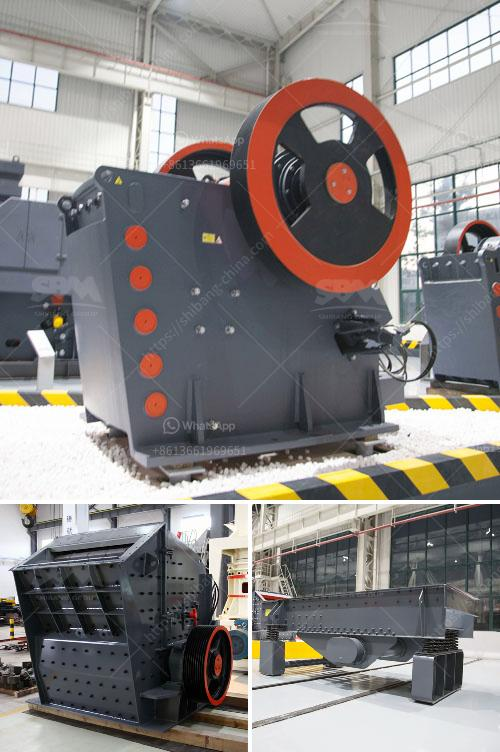

<h3>quartz crushing plant</h3>
Quartz is one of the most abundant minerals on Earth, found in a wide range of geological settings. It is a crystalline form of silicon dioxide (SiO2), also known as silica. This mineral is highly resistant to weathering and has a high melting point, making it an excellent material for various industrial applications. One of the primary uses of quartz is in the production of high-quality glass and ceramics. To meet the growing demand for quartz, many companies have invested in quartz crushing plants.

A quartz crushing plant is a key investment project, as it facilitates the production of high-quality quartz sand, which is vital for a wide range of applications. From glass and ceramics to the foundry and construction industries, quartz sand plays an essential role in various industrial sectors.

The process of quartz crushing primarily includes blasting, crushing, screening, and grinding. It starts with the extraction of quartz ore from deep underground mines. The ore is then conveyed to the crushing plant, where it is reduced in size using jaw crushers or impact crushers. The crushed quartz particles are then screened and separated into different sizes using vibrating screens. The larger particles are sent back to the crushers for further crushing, while the desired sizes are stored and ready for further processing.

In the grinding stage, the crushed quartz particles are ground into a fine powder using various types of mills. This process helps to remove impurities and create a high-purity quartz product that meets the stringent requirements of different industries. The final product is then transported and stored, ready for shipment to customers.

There are several factors to consider when setting up a quartz crushing plant. Firstly, the location of the plant is crucial, as it should be close to the quartz mines to minimize transportation costs. Additionally, access to necessary utilities such as water and electricity is essential for smooth plant operations.

Furthermore, the plant design should incorporate efficient and reliable machinery to ensure high productivity and minimize downtime. It is vital to choose crushers, screens, and mills that are capable of handling the desired capacity and produce the desired product quality. Regular maintenance and inspection of the plant equipment are necessary to prevent breakdowns and ensure continuous operations.

Environmental considerations are also crucial when establishing a quartz crushing plant. Efforts should be made to minimize dust emissions through the installation of dust suppression systems and proper covering and sealing of equipment. Water recycling systems should also be implemented to reduce water consumption and minimize environmental impact.

In conclusion, a quartz crushing plant plays a vital role in the production of high-quality quartz sand, which is essential for various industrial sectors. The establishment of such a plant requires careful planning, including the selection of the location, efficient machinery, and consideration of environmental factors. With the increasing demand for quartz sand, investing in a well-designed and properly maintained crushing plant can be a profitable venture for companies involved in the quartz industry.
<h3>Contact us</h3><ul><li><strong>Whatsapp:&nbsp;<a href="https://wa.me/8613661969651">+8613661969651</a></strong></li><li><a href="https://swt.shibang-china.com/?git&amp;zhl&amp;quartz crushing plant"><strong>Online Service(chat now)</strong></a></li></ul><h3>Related</h3><ul><li><a href='different crushed stones in nigeria.md'>different crushed stones in nigeria</a></li><li><a href='consumption ratio for ball mill.md'>consumption ratio for ball mill</a></li><li><a href='crusher stone prices peru.md'>crusher stone prices peru</a></li><li><a href='stone crushing equipment available.md'>stone crushing equipment available</a></li><li><a href='jaw crusher price saudi.md'>jaw crusher price saudi</a></li></ul>