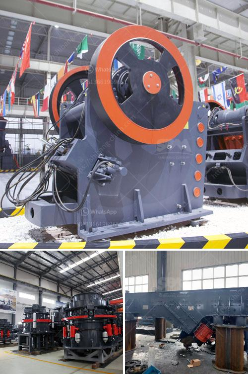

<h3>quartz crushing project report</h3>
Quartz is a mineral that is commonly found in granite, sandstone, limestone, and other rocks. It is one of the main components in the manufacturing of glass, ceramics, and various industrial products. Due to its numerous applications, the demand for quartz has significantly increased in recent years.

Crushing quartz to obtain the quartz powder has become a major project for many businesses. The market for crushed quartz is expanding and offers tremendous opportunities for growth. A quartz crushing project report is vital to determine the feasibility of the project and evaluate the financial aspects.

Crushing quartz has been a significant challenge for many companies. Initially, extracting quartz from mines was a laborious task and involved a lot of manual labor. However, with advancements in technology, the process has become much easier and efficient. Crushing quartz involves various stages such as primary crushing, secondary crushing, and crushing to obtain the desired particle size.

A quartz crushing project report provides an in-depth analysis of the project's profitability, feasibility, and investment requirements. Sufficient market research is essential to understand the demand and competition in the market. Additionally, assessing the availability of raw materials, machinery, and manpower is crucial for planning and executing the project successfully.

The report should also include a detailed financial analysis, including the cost of equipment, machinery, labor, and other overhead expenses. The revenue projections should be based on realistic market estimates and price trends. It is important to evaluate the expected return on investment (ROI), payback period, and associated risks to make an informed decision.

Moreover, environmental impact assessment is crucial for any crushing project. Quartz crushing generates dust and noise, which can have adverse effects on the surroundings. Implementing proper pollution control measures and obtaining necessary permits and licenses is essential to ensure compliance with environmental regulations.

In conclusion, a quartz crushing project report is a fundamental tool for businesses looking to venture into this lucrative industry. Proper planning, market research, and financial analysis are vital to maximize profits and minimize risks. With the right approach and adequate resources, a quartz crushing project can be a successful and profitable venture.
<h3>Contact us</h3><ul><li><strong>Whatsapp:&nbsp;<a href="https://wa.me/8613661969651">+8613661969651</a></strong></li><li><a href="https://swt.shibang-china.com/?git&amp;zhl&amp;quartz crushing project report"><strong>Online Service(chat now)</strong></a></li></ul><h3>Related</h3><ul><li><a href='coal pulverizer machine.md'>coal pulverizer machine</a></li><li><a href='cement plant cost estimation cement plant cost.md'>cement plant cost estimation cement plant cost</a></li><li><a href='rental of portable crusher in saudi arabia.md'>rental of portable crusher in saudi arabia</a></li><li><a href='cone crusher calculation.md'>cone crusher calculation</a></li><li><a href='quarry machine manufacturing company in malaysia.md'>quarry machine manufacturing company in malaysia</a></li></ul>