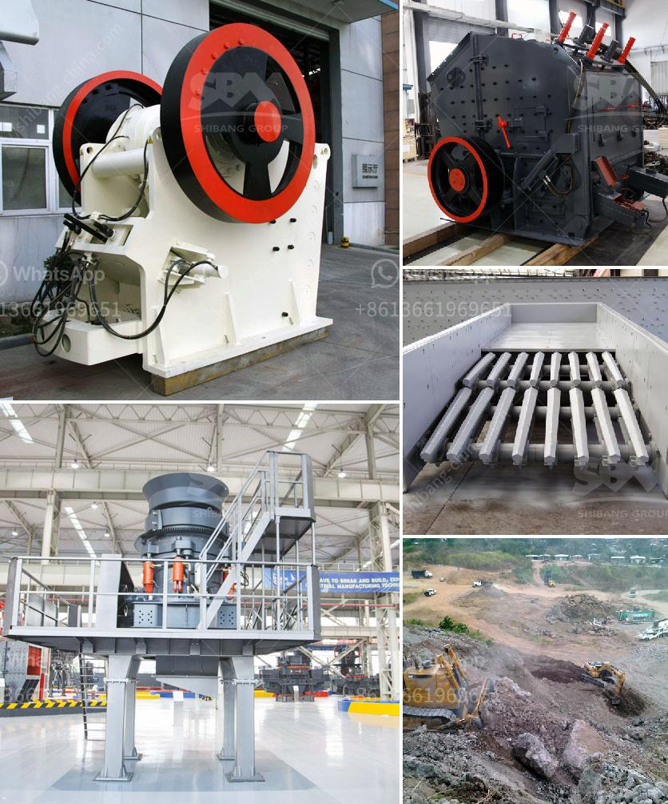

<h3>quartz grinding ball mill sizes list</h3>
Quartz is a mineral resource with a wide variety of uses. One of its most common applications is in the production of glass, ceramics, and other materials. To obtain the desired fineness of quartz powder, quartz grinding ball mills are essential equipment.

A quartz grinding ball mill, also known as a grinder, is used extensively for grinding quartz and other minerals into a fine powder. This equipment plays a crucial role in the quartz industry. It offers a wide range of grinding options to grind different types of materials, such as feldspar, marble, granite, and more.

Quartz grinding ball mills come in different sizes to fit various applications. The size of the mill determines the grinding efficiency and the final product's fineness. As a result, different sizes of ball mills are available to cater to specific needs. Let's delve into the different sizes of quartz grinding ball mills commonly found in the market.

Small-sized ball mills are suitable for laboratories and small-scale manufacturing units. These mills have a lower capacity as compared to larger mills. Usually, they have a capacity ranging from 0.65-2 tons per hour. Small-sized ball mills are perfect for grinding small quantities of quartz or other minerals.

Medium-sized ball mills are commonly used in medium-sized production units or small and medium-sized mining operations. These mills have a capacity ranging from 2-20 tons per hour. They are suitable for grinding a moderate amount of quartz or other minerals.

Large-sized ball mills are ideal for large-scale quartz grinding operations. They are commonly used in industries such as cement, silicate products, new building materials, refractory materials, fertilizers, black and non-ferrous metal beneficiation, and glass ceramics production. These mills have a capacity exceeding 20 tons per hour. The large size allows for efficient grinding of quartz or other minerals in large quantities.

The choice of the appropriate quartz grinding ball mill size depends on various factors such as the required capacity, input size of the material to be ground, and the final product's fineness. Additionally, the characteristics of the material being ground, such as hardness and abrasiveness, also influence the choice of the ball mill size. It is crucial to select the right size of ball mill to ensure optimal grinding performance and efficient production.

In conclusion, quartz grinding ball mill sizes vary depending on the application and desired fineness of the final product. Small-sized ball mills are suitable for laboratory use or small-scale production, while medium-sized and large-sized ball mills are suitable for medium to large-scale operations. The selection of the appropriate ball mill size is essential for efficient grinding and achieving the desired product fineness.
<h3>Contact us</h3><ul><li><strong>Whatsapp:&nbsp;<a href="https://wa.me/8613661969651">+8613661969651</a></strong></li><li><a href="https://swt.shibang-china.com/?git&amp;zhl&amp;quartz grinding ball mill sizes list"><strong>Online Service(chat now)</strong></a></li></ul><h3>Related</h3><ul><li><a href='crushing plant supplier.md'>crushing plant supplier</a></li><li><a href='quartz stone powder.md'>quartz stone powder</a></li><li><a href='cone crusher csd 900 price.md'>cone crusher csd 900 price</a></li><li><a href='coal crusher machine capacity of 5 tons an hour.md'>coal crusher machine capacity of 5 tons an hour</a></li><li><a href='limestone crushers for sale.md'>limestone crushers for sale</a></li></ul>