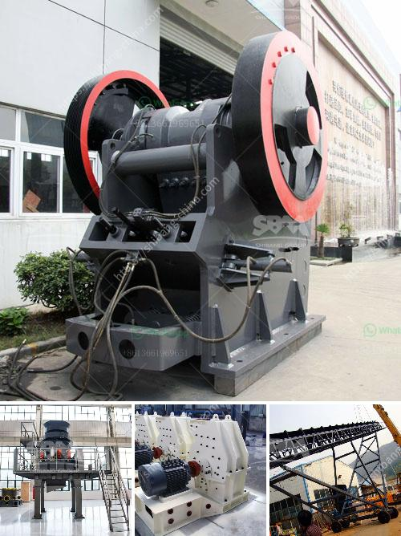

<h3>quartz manufacturing plant in india</h3>
India has emerged as a leading player in the global manufacturing industry, and the quartz manufacturing sector is no exception. With its rich reserves of quartz, abundant labor force, and favorable government policies, India has become an attractive destination for setting up quartz manufacturing plants.

Quartz is a versatile mineral that finds extensive application in various industries such as glass, ceramics, electronics, and construction. Its unique properties, including high hardness, resistance to wear and tear, and low thermal expansion, make it an ideal material for manufacturing a wide range of products.

Setting up a quartz manufacturing plant in India offers several advantages. Firstly, India has one of the largest reserves of quartz in the world, ensuring a steady supply of raw materials at competitive prices. This not only reduces production costs but also ensures uninterrupted production and supply to meet growing demand.

Secondly, India boasts a large pool of skilled and semi-skilled labor, which is essential for operating and managing manufacturing plants efficiently. The availability of a skilled workforce ensures quality production and timely delivery, which are crucial in maintaining customer satisfaction.

Furthermore, the Indian government has introduced various policies and initiatives to promote ease of doing business in the country. These include favorable tax structures, subsidies, and streamlined regulatory processes, making it easier for businesses to set up and operate manufacturing facilities.

The presence of a robust transportation network and well-developed infrastructure further facilitates the smooth movement of raw materials and finished products. This helps in reducing logistics costs and ensures efficient supply chain management.

In conclusion, the establishment of quartz manufacturing plants in India is a strategic move for both domestic and international investors. India's abundant resources, skilled labor force, supportive government policies, and robust infrastructure make it an attractive destination. This sector holds immense potential for growth and can significantly contribute to the country's economic development.
<h3>Contact us</h3><ul><li><strong>Whatsapp:&nbsp;<a href="https://wa.me/8613661969651">+8613661969651</a></strong></li><li><a href="https://swt.shibang-china.com/?git&amp;zhl&amp;quartz manufacturing plant in india"><strong>Online Service(chat now)</strong></a></li></ul><h3>Related</h3><ul><li><a href='crushing plant in calatagan batangas.md'>crushing plant in calatagan batangas</a></li><li><a href='cement plant machine.md'>cement plant machine</a></li><li><a href='chromite ore beneficiation processing.md'>chromite ore beneficiation processing</a></li><li><a href='quartz stone cruher process.md'>quartz stone cruher process</a></li><li><a href='used portable crushing plant for sale.md'>used portable crushing plant for sale</a></li></ul>