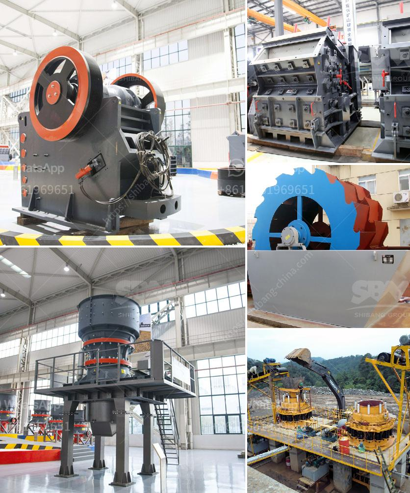

<h3>quartz mining process in andhra pradesh</h3>
Quartz is a mineral that is primarily composed of silicon and oxygen. It is one of the most abundant minerals on Earth and is found in a wide variety of geological formations. Quartz mining is an important process in andhra pradesh as it helps extract valuable minerals and materials from the Earth.

Andhra Pradesh is a state in southeastern India known for its rich mineral resources. The state is home to various types of minerals, including quartz. Quartz mining in Andhra Pradesh involves extracting quartz deposits from the ground and processing them to obtain different products.

The process of quartz mining in Andhra Pradesh starts with the identification of a quartz deposit. The location and size of the deposit are determined through various geological surveys and assessments. Once a promising deposit is identified, the mining process begins.

The first step in quartz mining is the clearing of the land. This involves removing any vegetation, trees, or other obstacles to allow access to the quartz deposit. Heavy machinery, such as bulldozers, is used to clear the land, creating a level surface for mining operations.

After the land is cleared, the next step is drilling. Holes are drilled into the ground using specialized equipment to reach the quartz deposit. These holes are strategically placed based on geological surveys and assessments to maximize the extraction of quartz.

Once the holes are drilled, explosives are used to break up the rock and extract the quartz. Controlled blasts are carried out to minimize damage to the surrounding area and ensure the safety of the workers. The broken rock is then loaded onto trucks and transported to a processing facility.

At the processing facility, the quartz is crushed and sorted into different grades based on size and purity. Various techniques, including grinding and screening, are used to achieve the desired grade and quality of quartz. The final products can range from industrial-grade quartz used in construction and electronics to high-purity quartz used in the production of solar panels and semiconductors.

Quartz mining in Andhra Pradesh provides several economic benefits to the region. It creates job opportunities for local residents and contributes to the state's revenue through taxes and royalties. Additionally, the extracted quartz is used in various industries, such as glass manufacturing, ceramics, and electronics, supporting the growth of these sectors.

However, quartz mining also has potential environmental impacts. The clearing of land and extraction of quartz can result in habitat destruction and loss of biodiversity. It is essential for mining companies to implement sustainable practices and mitigate these impacts through proper land reclamation and restoration.

In conclusion, quartz mining is an important process in Andhra Pradesh that helps extract valuable minerals and materials from the Earth. The process involves identifying and clearing a quartz deposit, drilling, blasting, transportation, and processing to obtain different grades of quartz. While it provides economic benefits, it is crucial to balance mining activities with sustainable practices to minimize environmental impacts.
<h3>Contact us</h3><ul><li><strong>Whatsapp:&nbsp;<a href="https://wa.me/8613661969651">+8613661969651</a></strong></li><li><a href="https://swt.shibang-china.com/?git&amp;zhl&amp;quartz mining process in andhra pradesh"><strong>Online Service(chat now)</strong></a></li></ul><h3>Related</h3><ul><li><a href='kaolin crusher production costs.md'>kaolin crusher production costs</a></li><li><a href='small scale mining equipment south africa price.md'>small scale mining equipment south africa price</a></li><li><a href='supplier of grinding stone.md'>supplier of grinding stone</a></li><li><a href='calcium carbide plant and machinery.md'>calcium carbide plant and machinery</a></li><li><a href='mobile stone crushers south africa.md'>mobile stone crushers south africa</a></li></ul>