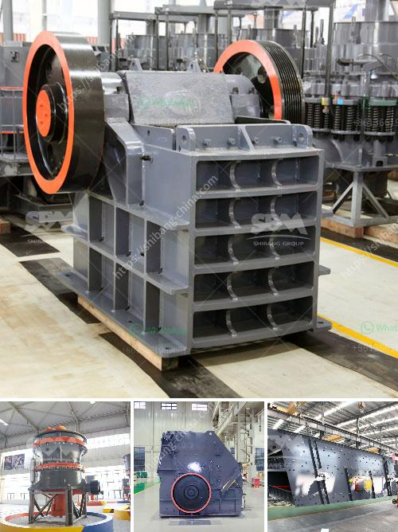

<h3>quartz powder manufacturing machinery</h3>
Quartz powder is a commonly used raw material in various industries, such as glass, ceramics, and electronics. To make high-quality quartz powder, a specialized manufacturing machinery is required. The machinery involved in the quartz powder manufacturing process includes crushers, conveyors, feeders, magnetic separators, and dust collectors.

The first step in the manufacturing of quartz powder is crushing the quartz stone. This is done by using a crusher, which breaks the large quartz stone into smaller pieces. The crushed quartz is then transported by belt conveyor to the feeder for grinding. Once the quartz reaches the feeder, it is evenly fed into ball mill for grinding.

The grinding process generates high amounts of heat, which needs to be controlled to ensure the quality of the quartz powder. To regulate the temperature, water is added during the grinding process. After sufficient grinding, the quartz powder is collected in a dust collector.

Next, the quartz powder undergoes magnetic separation to separate any impurities or iron fragments. This is important to obtain a pure and high-grade quartz powder. The magnetic separator is equipped with strong magnets that attract and separate any magnetic materials from the quartz powder.

Finally, the quartz powder is packaged and ready for distribution. The machinery involved in the manufacturing process ensures that the quartz powder is of consistent quality and meets the specific requirements of various industries.

In conclusion, the manufacturing of quartz powder requires specialized machinery to ensure the high-quality and purity of the final product. The process involves crushing, grinding, magnetic separation, and packaging. By using the right machinery, manufacturers can produce quartz powder that meets the stringent standards of various industries, making it a valuable raw material in the market.
<h3>Contact us</h3><ul><li><strong>Whatsapp:&nbsp;<a href="https://wa.me/8613661969651">+8613661969651</a></strong></li><li><a href="https://swt.shibang-china.com/?git&amp;zhl&amp;quartz powder manufacturing machinery"><strong>Online Service(chat now)</strong></a></li></ul><h3>Related</h3><ul><li><a href='quartz powder mining mill.md'>quartz powder mining mill</a></li><li><a href='crushing plant in pangasinan.md'>crushing plant in pangasinan</a></li><li><a href='second hand quarry crusher machinery price in india.md'>second hand quarry crusher machinery price in india</a></li><li><a href='kaolin crusher production costs.md'>kaolin crusher production costs</a></li><li><a href='mica crusher production plants.md'>mica crusher production plants</a></li></ul>