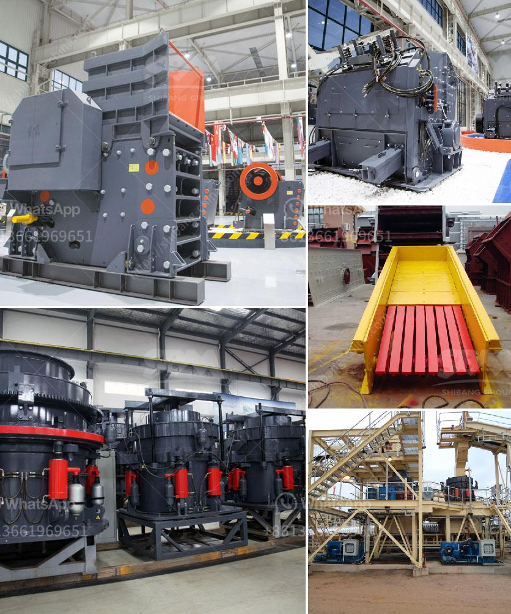

<h3>quartz powder mining mill</h3>
Quartz powder, also known as silica powder, is a vital raw material used in various industries such as glass, ceramics, metallurgy, and chemicals. It is widely used in fabrication of optical instruments, windows, and lenses due to its high transparency and excellent chemical and physical properties. The production of quartz powder involves several stages such as crushing, grinding, sieving, and classifying. The mining of quartz powder requires the use of specialized machinery and equipment to ensure the efficient production of high-quality powder.

One crucial equipment used in quartz powder mining is the quartz powder mining mill. This machine is designed to grind quartz rock into fine powder, which is used for various applications. The quartz powder mining mill is particularly suitable for high purity quartz sand production, with the particle size ranging from 0.3-0.5mm. It is designed to grind quartz or silica minerals into fine powder, with high efficiency and low energy consumption.

The quartz powder mining mill consists of a rotating cylindrical shell filled with grinding media, such as ceramic balls, pebbles, or rods. The grinding media crushes and grinds the quartz particles present in the mill into fine powder. The powdered quartz is then collected in cyclones and sent for further processing. The size and characteristics of the quartz powder can be controlled by adjusting the grinding parameters such as speed, media size, and time.

One of the main advantages of using a quartz powder mining mill is its ability to produce high-quality powder with a narrow particle size distribution. This is essential for industries that require precise control over the particle size and distribution, such as the glass industry. The homogeneous particle size distribution ensures consistent and uniform properties in the final product, resulting in improved product performance and quality.

The quartz powder mining mill also offers high energy efficiency, reducing the overall energy consumption during the grinding process. This not only reduces the operating costs but also contributes to environmental sustainability by conserving energy resources. Additionally, the compact design and low maintenance requirements of the machine make it a cost-effective solution for quartz powder production.

The quartz powder mining mill is available in different sizes and capacities to meet the specific requirements of different applications. It can be used in both batch and continuous operation modes, allowing for flexible production schedules. The machine can be easily integrated into existing production lines or used as a standalone unit, providing versatility and adaptability to different manufacturing processes.

In conclusion, the quartz powder mining mill is a crucial machine for the efficient production of high-quality quartz powder. Its ability to produce fine powder with controlled particle size and distribution, coupled with its energy efficiency and low maintenance requirements, makes it an ideal choice for various industries. With the increasing demand for quartz powder, the quartz powder mining mill plays a vital role in ensuring a steady supply of high-quality powder for various applications.
<h3>Contact us</h3><ul><li><strong>Whatsapp:&nbsp;<a href="https://wa.me/8613661969651">+8613661969651</a></strong></li><li><a href="https://swt.shibang-china.com/?git&amp;zhl&amp;quartz powder mining mill"><strong>Online Service(chat now)</strong></a></li></ul><h3>Related</h3><ul><li><a href='stone crusher machine price in usa.md'>stone crusher machine price in usa</a></li><li><a href='the vertical mill ireland information.md'>the vertical mill ireland information</a></li><li><a href='stone crushing company in philippines.md'>stone crushing company in philippines</a></li><li><a href='aggregate production process.md'>aggregate production process</a></li><li><a href='how to control partials size in vertical hammer mill.md'>how to control partials size in vertical hammer mill</a></li></ul>