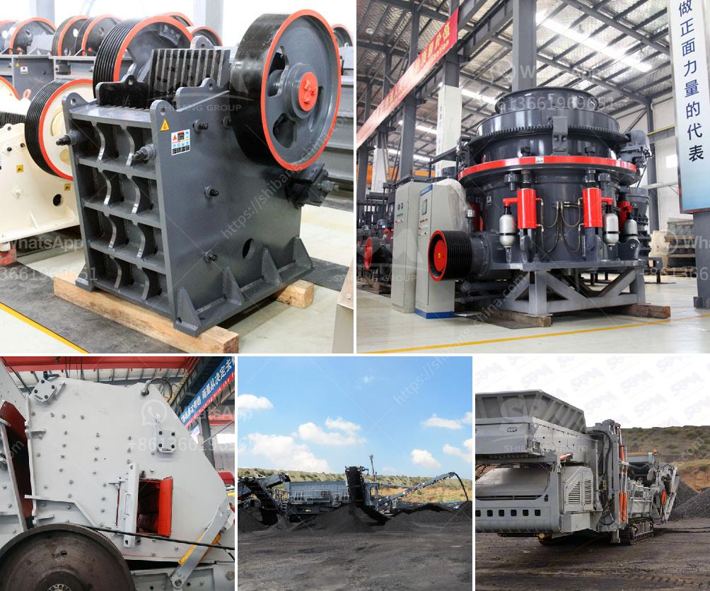

<h3>quartz processing plant</h3>
Quartz is one of the most abundant minerals found in the Earth's crust. It is a hard, crystalline mineral with a wide range of industrial uses. From electronics to construction materials, quartz is a versatile and essential ingredient in many products.

To meet the growing demand for quartz, specialized processing plants are needed. These plants utilize advanced technology to extract, refine, and purify quartz for various applications. In this article, we will explore the process and importance of a quartz processing plant.

The first step in quartz processing is the extraction of quartz ore from the ground. This is done through various mining methods, depending on the type of deposit and its location. Traditional methods such as open-pit mining and underground mining are commonly used. Once the ore is extracted, it is transported to the processing plant for further refinement.

At the processing plant, the quartz ore undergoes several stages of crushing, grinding, and classifying to separate it into different grades. The crushing process reduces the size of the ore particles, while grinding further refines it into a powder-like consistency. Classifying involves separating the finer particles from the coarser ones, ensuring a uniform product.

After the initial processing, the quartz powder may undergo additional treatments to enhance its quality. These treatments may include magnetic separation, flotation, and acid leaching to remove impurities and improve the quartz's purity and color. The final product is a high-quality quartz powder that can be used in various industries.

The processed quartz powder has a wide range of applications. In the electronics industry, it is used as a key component in semiconductors and electronic devices. Its excellent electrical properties make it ideal for use in circuit boards, transistors, and solar panels. Quartz powder is also used in the production of glass, ceramics, and paints. Its high melting point and resistance to thermal shock make it valuable in industrial applications such as foundry casting, refractory bricks, and insulation materials.

Apart from its industrial uses, quartz is also highly valued for its aesthetic qualities. It is widely used as a decorative stone in buildings, countertops, and monuments. Its beauty, durability, and resistance to heat and stains make it a popular choice among homeowners and architects.

The establishment of a quartz processing plant plays a crucial role in meeting the global demand for quartz. These plants combine innovation and technology to efficiently extract and process quartz ore, producing high-quality products for various industries. They also contribute to economic growth by creating job opportunities and promoting local development.

In conclusion, the quartz processing plant is a vital component in the quartz industry. Through a series of extraction, crushing, grinding, and refining processes, quartz ore is transformed into a versatile powder that is used in numerous applications. With increasing demand and advances in technology, these plants are essential in meeting the needs of various industries while contributing to economic growth and sustainable development.
<h3>Contact us</h3><ul><li><strong>Whatsapp:&nbsp;<a href="https://wa.me/8613661969651">+8613661969651</a></strong></li><li><a href="https://swt.shibang-china.com/?git&amp;zhl&amp;quartz processing plant"><strong>Online Service(chat now)</strong></a></li></ul><h3>Related</h3><ul><li><a href='sell plant crusher of stone.md'>sell plant crusher of stone</a></li><li><a href='types of belt conveyors used in cement industries.md'>types of belt conveyors used in cement industries</a></li><li><a href='cone crusher csd 900 price.md'>cone crusher csd 900 price</a></li><li><a href='mining equipment and hire zimbabwe.md'>mining equipment and hire zimbabwe</a></li><li><a href='carbon black processing plant.md'>carbon black processing plant</a></li></ul>