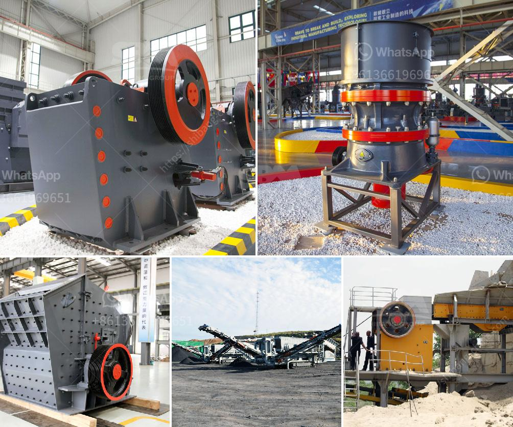

<h3>quartz stone cruher process</h3>
Quartz, also known as engineered stone, is a durable and low-maintenance material used in a wide variety of applications. From kitchen countertops to bathroom tiles, quartz has become an increasingly popular choice among homeowners and designers. However, the process of producing quartz can be complex and require specialized equipment.

The first step in the quartz stone crushing process is coarse crushing. It is performed by feeding the quartz stone into the jaw crusher, which has a strong crushing capacity and high output. During the process, large pieces of quartz stone are crushed into smaller particles by the jaw crusher. This process forms the first stage in the crushing process.

After the coarse crushing stage, the quartz stone enters the impact crusher for fine crushing. The fine crushing process is important because it determines the final particle size and shape of the quartz stone. The impact crusher uses the principle of "stone hitting stone" to achieve the purpose of crushing. The quartz stone is repeatedly impacted and crushed by the rotor, resulting in a finer particle size.

Next, the crushed quartz stone enters the vibrating screen for screening. The vibrating screen separates the quartz stone based on its particle size. The oversized quartz stone is returned to the impact crusher for re-crushing, while the quartz stone that meets the desired particle size is sent to the sand making machine for further shaping.

In the sand making machine, the quartz stone is shaped into a cubical shape through the principle of "stone to stone" crushing. The sand making machine uses a high-speed rotating rotor to throw the quartz stone against the quartz stone, causing it to collide and rub against each other. This process shapes the quartz stone into a cubical shape, making it suitable for various applications.

Finally, the shaped quartz stone is transferred to the finished material pile through a conveyor belt. The entire quartz stone crushing process is completed under the control of a computerized system, ensuring high efficiency and consistent product quality.

In addition to the above process, quartz stone may undergo additional steps, such as cleaning, polishing, and cutting, depending on the desired final product. These additional steps further enhance the appearance and durability of the quartz stone.

In conclusion, the process of quartz stone crushing involves various stages, including coarse crushing, fine crushing, screening, shaping, and final product transfer. Each stage requires specific equipment and expertise to ensure the quality and efficiency of the final product. With its durability and versatility, quartz stone continues to be a popular material choice for various construction and design projects.
<h3>Contact us</h3><ul><li><strong>Whatsapp:&nbsp;<a href="https://wa.me/8613661969651">+8613661969651</a></strong></li><li><a href="https://swt.shibang-china.com/?git&amp;zhl&amp;quartz stone cruher process"><strong>Online Service(chat now)</strong></a></li></ul><h3>Related</h3><ul><li><a href='graphite processing flowsheet.md'>graphite processing flowsheet</a></li><li><a href='hammer mill for concentrate price.md'>hammer mill for concentrate price</a></li><li><a href='mobile crusher in the coal mining.md'>mobile crusher in the coal mining</a></li><li><a href='stone crushing prices.md'>stone crushing prices</a></li><li><a href='crusher manufacturer in.md'>crusher manufacturer in</a></li></ul>