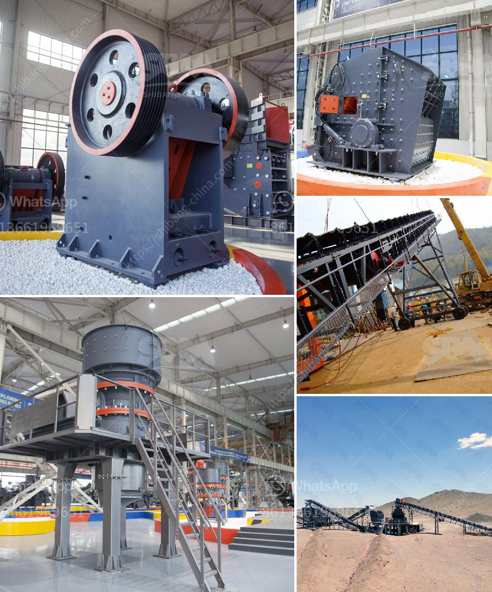

<h3>quartz stone powder</h3>
Quartz stone powder, also known as quartz dust or quartz flour, is a byproduct of quartz mining and manufacturing. It is widely utilized as an additive in various industries due to its fine particle size and high silica content. In this article, we will explore the applications, benefits, and production process of quartz stone powder.

Firstly, let's delve into the manufacturing process of quartz stone powder. It is derived from quartz rocks, which are abundant in nature. The extraction of raw quartz involves mining, cutting, and crushing of quartz rocks into smaller particles. Subsequently, the crushed quartz undergoes grinding and milling processes to achieve a fine powder consistency. It is important to note that the production process ensures the removal of impurities and other unwanted elements, resulting in a pure and highly refined quartz powder.

When it comes to applications, quartz stone powder finds its utility across various industries. One of the major uses of quartz powder is in the manufacturing of glass. Due to its high silica content, quartz powder imparts durability, clarity, and scratch-resistance to glass products. It is extensively used in the production of glass bottles, lenses, windows, and mirrors.

Furthermore, quartz stone powder is an essential component in ceramics and porcelain manufacturing. Its fine particle size enhances the strength, hardness, and longevity of ceramic products. It is used as a filler in ceramic tiles, sanitary ware, tableware, and other decorative items. The addition of quartz powder also helps in regulating the shrinkage and expansion properties of ceramics.

The construction industry also relies on quartz stone powder for multiple purposes. It is used as a component in cement and concrete production, enhancing their strength and durability. With its excellent bonding capacity, quartz powder acts as a binding agent, making it ideal for constructing structures like bridges, road pavements, and buildings.

Additionally, quartz powder finds applications in the chemical industry. It is used as a raw material in the production of silicones, resins, and adhesives. The fine particles of quartz aid in improving the flowability and stability of these chemical compounds, thereby enhancing their performance and quality.

In the realm of cosmetics and personal care products, quartz stone powder is utilized as an exfoliating agent. It helps in removing dead skin cells, unclogging pores, and rejuvenating the skin's appearance. Due to its gentle abrasive properties, it is preferred over synthetic alternatives for its natural origins.

Besides its wide range of applications, quartz stone powder also offers numerous benefits. Its high silica content provides exceptional heat resistance, making it suitable for applications that involve high temperatures. Quartz powder is chemically inert, ensuring that it does not react with other materials or contribute to any chemical reactions. Moreover, it is non-toxic and environmentally friendly, reflecting its sustainability as a raw material.

To sum it up, quartz stone powder is a versatile material that finds applications in various industries. From being an additive in glass and ceramic manufacturing to enhancing the strength of construction materials, it offers a plethora of uses. With its natural origins, heat resistance, and non-toxic properties, quartz stone powder is a reliable and sustainable choice for countless industrial applications.
<h3>Contact us</h3><ul><li><strong>Whatsapp:&nbsp;<a href="https://wa.me/8613661969651">+8613661969651</a></strong></li><li><a href="https://swt.shibang-china.com/?git&amp;zhl&amp;quartz stone powder"><strong>Online Service(chat now)</strong></a></li></ul><h3>Related</h3><ul><li><a href='crushing machine south africa.md'>crushing machine south africa</a></li><li><a href='white cement manufacturing process pdf.md'>white cement manufacturing process pdf</a></li><li><a href='pulveriser manufacturer in shanghai.md'>pulveriser manufacturer in shanghai</a></li><li><a href='quarry crusher equipment suppliers miami.md'>quarry crusher equipment suppliers miami</a></li><li><a href='open pit mobile crushing plant.md'>open pit mobile crushing plant</a></li></ul>