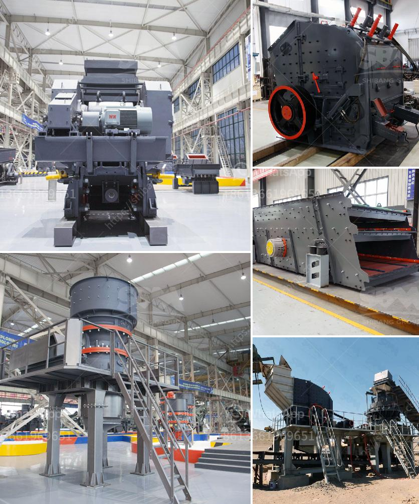

<h3>quartz stone processing machine</h3>
In today's competitive market, efficiency is everything. Industries are constantly on the lookout for advanced technology and machinery that can streamline their processes and deliver high-quality results. One such machine that has revolutionized the stone processing industry is the quartz stone processing machine.

Quartz stone, widely known for its durability, versatility, and aesthetic appeal, has gained significant popularity in various applications, including countertops, flooring, and wall cladding. However, the process of turning raw quartz into a finished product is a meticulous one that requires precision and expertise. This is where the quartz stone processing machine comes into play.

The quartz stone processing machine is a state-of-the-art piece of equipment that has greatly enhanced the efficiency of stone processing plants. It delivers unmatched precision and uniformity in cutting, shaping, and polishing quartz slabs. This machine is designed to handle the entire production process, from the initial cutting and shaping to the final polishing and finishing. Its advanced technology ensures that every piece of quartz is processed to perfection, meeting the exact specifications and design requirements of the clients.

One of the key features of the quartz stone processing machine is its automated cutting system. Traditional stone processing involved a labor-intensive process of manually cutting and shaping quartz slabs, which was not only time-consuming but also prone to human errors. With the automated cutting system, the machine uses precise computer-based programming to accurately cut the quartz slabs, reducing the chances of errors and ensuring consistent results. This not only saves time but also minimizes material wastage, making the process more cost-effective.

Another notable feature of the quartz stone processing machine is its high-speed polishing system. Polishing quartz slabs to achieve a smooth and glossy finish was once a laborious task. However, the advanced polishing system in these machines allows for fast and efficient polishing, significantly reducing the production time. This also ensures that every quartz slab receives a flawless finish, enhancing its visual appeal and market value.

Furthermore, the quartz stone processing machine is equipped with a user-friendly interface, making it easy to operate, even for individuals with minimal technical knowledge. The machine is also designed with safety features to ensure the well-being of the operators. It can be easily integrated into existing stone processing plants, complementing the existing machinery and processes.

The introduction of the quartz stone processing machine has not only improved the efficiency and productivity of stone processing plants but also enhanced the quality and precision of the end product. With its automated cutting and polishing systems, this machine guarantees consistency, accuracy, and speed in the processing of quartz slabs. Industries can now meet the growing demand for quartz stone products while maintaining high standards of quality and reducing production costs.

In conclusion, the quartz stone processing machine has brought a revolution to the manufacturing industry. It has replaced traditional, time-consuming methods and introduced advanced technology that streamlines the entire process, from cutting to polishing. With its efficiency, precision, and ease of use, this machine is undoubtedly a game-changer in the world of stone processing, allowing manufacturers to stay competitive and deliver top-quality quartz stone products.
<h3>Contact us</h3><ul><li><strong>Whatsapp:&nbsp;<a href="https://wa.me/8613661969651">+8613661969651</a></strong></li><li><a href="https://swt.shibang-china.com/?git&amp;zhl&amp;quartz stone processing machine"><strong>Online Service(chat now)</strong></a></li></ul><h3>Related</h3><ul><li><a href='vibrating wire screen suppliers.md'>vibrating wire screen suppliers</a></li><li><a href='limestone powder manufacture machine.md'>limestone powder manufacture machine</a></li><li><a href='china mineral ore processing mill ball.md'>china mineral ore processing mill ball</a></li><li><a href='consultants to help to start a stone crusher.md'>consultants to help to start a stone crusher</a></li><li><a href='grinding size of bentonite crusher.md'>grinding size of bentonite crusher</a></li></ul>