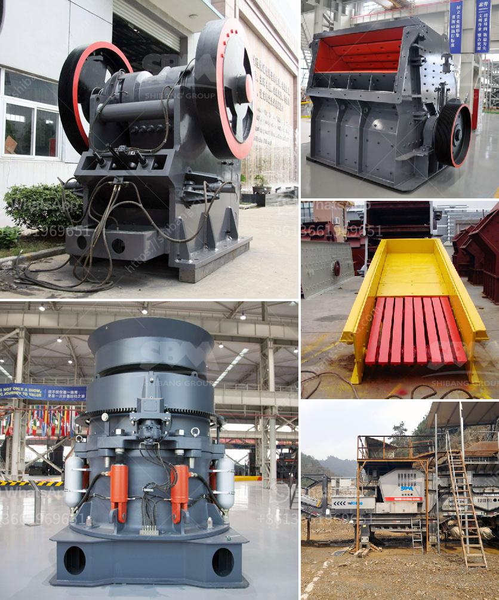

<h3>quick lime powder machine</h3>
Lime, or calcium oxide, is an essential ingredient used in various industries like construction, agriculture, and chemical manufacturing. Traditionally, obtaining lime powder involved a labor-intensive process that required heating limestone at extremely high temperatures. However, with recent advancements in technology, a revolutionary piece of equipment called the quick lime powder machine has transformed the lime industry and streamlined production processes.

The quick lime powder machine, also known as the lime briquetting machine or lime ball press machine, is an innovative device designed to create powdered lime from limestone or calcium carbonate. This machine can efficiently and effectively convert limestone into lime powder, saving countless hours of manual labor in the process.

One of the key features of the quick lime powder machine is its simplicity. It consists of a feeding system, a crushing system, a conveying system, and a discharging system. The limestone is fed into the machine through the feeding system and crushed into small pieces by the crushing system. The powdered limestone is then conveyed to the discharging system, where it is compressed into briquettes or released as powder based on the desired end-product.

The quick lime powder machine offers numerous advantages over traditional methods of producing lime powder. Firstly, it significantly reduces manual labor. In the past, workers had to manually crush and grind limestone, a time-consuming and physically exhausting process. With the quick lime powder machine, the entire process is automated, requiring minimal human intervention. This not only eliminates the risk of physical strain on workers but also increases productivity and operational efficiency.

Secondly, the quick lime powder machine ensures consistency in lime powder production. Human error can often lead to variations in the quality and particle size of the lime powder produced. However, the machine's precise and controlled crushing and pressing mechanisms ensure uniformity in the resulting lime powder. This is crucial, as the end-product's quality directly impacts its usability in different industries such as construction, water treatment, and metallurgy.

Furthermore, the quick lime powder machine allows for customization based on specific industry requirements. The machine's adjustable settings enable operators to control the size and density of the lime powder produced. This flexibility ensures that the machine can cater to various industries and their specific needs.

Another significant advantage of the quick lime powder machine is its environmental friendliness. Traditional lime production methods often result in excessive carbon emissions and a significant impact on air quality. However, the quick lime powder machine employs modern technology that minimizes carbon emissions and dust pollution. This makes it a more sustainable and eco-friendly option for lime powder production.

In conclusion, the quick lime powder machine has revolutionized the lime industry by automating and refining the lime powder production process. Its convenience, precision, versatility, and environmental benefits make it an invaluable asset for industries reliant on lime powder. As technology continues to evolve, we can expect further developments in lime powder production that will enhance efficiency, sustainability, and overall industry growth.
<h3>Contact us</h3><ul><li><strong>Whatsapp:&nbsp;<a href="https://wa.me/8613661969651">+8613661969651</a></strong></li><li><a href="https://swt.shibang-china.com/?git&amp;zhl&amp;quick lime powder machine"><strong>Online Service(chat now)</strong></a></li></ul><h3>Related</h3><ul><li><a href='supplier of grinding stone.md'>supplier of grinding stone</a></li><li><a href='superfine grinding mills in shanhgai.md'>superfine grinding mills in shanhgai</a></li><li><a href='malaysia ball mill.md'>malaysia ball mill</a></li><li><a href='price of a set of stone crushing machine.md'>price of a set of stone crushing machine</a></li><li><a href='chrome crushing plant.md'>chrome crushing plant</a></li></ul>