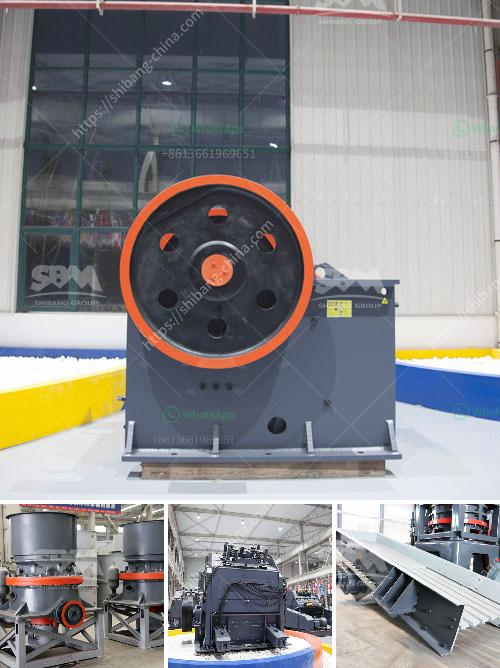

<h3>quotation for hydraulic cone crusher</h3>
The mining industry is evolving and the equipment used in the industry is constantly being updated to make mining more efficient and safer. The hydraulic cone crusher is a game-changer in this regard. It is one of the most technologically advanced crushers on the market today and boasts numerous benefits for the mining industry.

With the advances in aggregate and ore processing technology, the hydraulic cone crusher is one such piece of equipment that can easily fit into the mining industry puzzle. This advanced machinery uses hydraulic systems to control and adjust the size and quality of the product output. It can reduce the size of large rocks into smaller, uniform particles, making it easier to process and transport.

When looking for a hydraulic cone crusher, it is crucial to consider the specifications that align with your particular mining needs. Quotations generally cover the technical aspects of the crusher, including the model, type, size, power, and capacity. These specifications ensure that it meets the requirements of your mining operation.

One key advantage of the hydraulic cone crusher is that it offers superior protection against overloading. The built-in hydraulic system automatically releases any uncrushable materials or tramp metal to prevent damage to the crusher. This feature not only protects the equipment but also reduces downtime and maintenance costs.

Another remarkable feature of the hydraulic cone crusher is its ease of maintenance. The crusher is designed with easy access to all the crucial components, making regular inspection and maintenance hassle-free. This saves valuable time and allows for more efficient operation, contributing to increased productivity.

In terms of price, quotations for hydraulic cone crushers can vary depending on the model, capacity, and features. However, considering the long-term benefits and durability that hydraulic cone crushers offer, they are a worthwhile investment for any mining operation.

To conclude, the hydraulic cone crusher is a game-changer in the mining industry. Its advanced technology, excellent protection against overloading, and ease of maintenance make it an ideal choice for miners. When considering a hydraulic cone crusher, obtaining a comprehensive quotation will ensure that you select the most suitable equipment for your mining operation. Take advantage of this cutting-edge technology to enhance your mining efficiency and productivity.
<h3>Contact us</h3><ul><li><strong>Whatsapp:&nbsp;<a href="https://wa.me/8613661969651">+8613661969651</a></strong></li><li><a href="https://swt.shibang-china.com/?git&amp;zhl&amp;quotation for hydraulic cone crusher"><strong>Online Service(chat now)</strong></a></li></ul><h3>Related</h3><ul><li><a href='crusher in pakistan.md'>crusher in pakistan</a></li><li><a href='ton per day crusher barmac.md'>ton per day crusher barmac</a></li><li><a href='conveyor supplier in the philippines.md'>conveyor supplier in the philippines</a></li><li><a href='used raymond mill for sale in india.md'>used raymond mill for sale in india</a></li><li><a href='rolling ball mills manufacturer.md'>rolling ball mills manufacturer</a></li></ul>