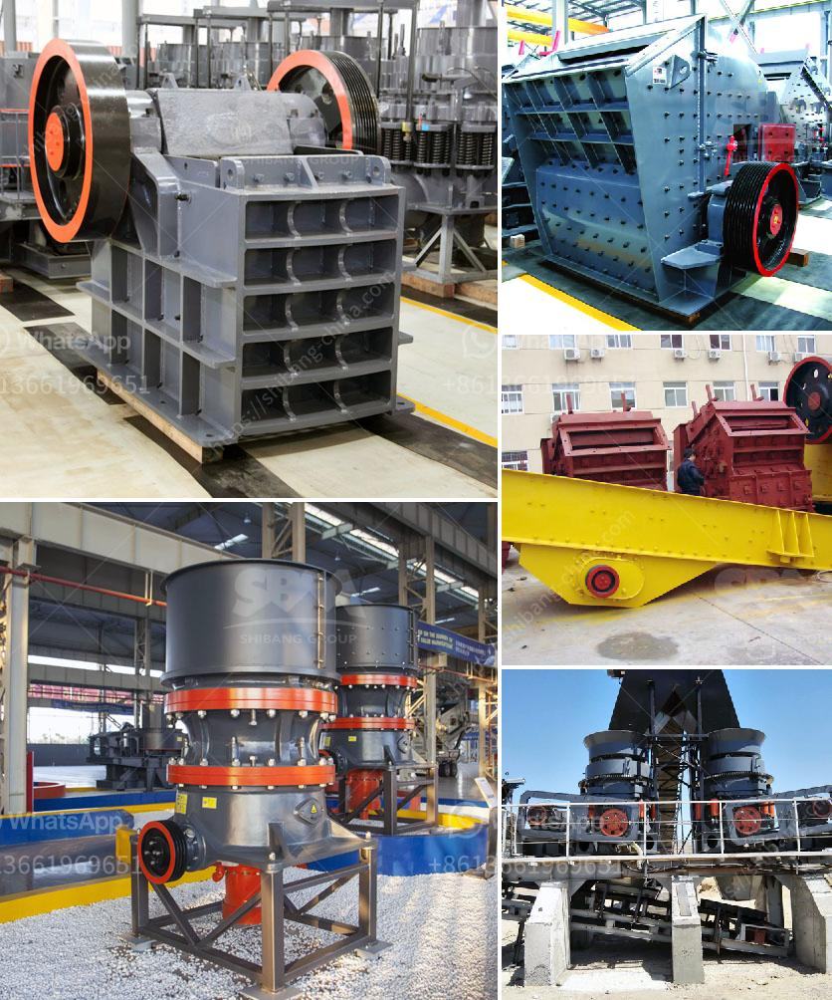

<h3>raymond hammer mill</h3>
In the grinding industry, size reduction plays a crucial role. Not only does it influence the quality of the final product, but it also affects the efficiency of various processes. One machine that stands out in accomplishing this task is the Raymond Hammer Mill. With its state-of-the-art design and high-performance capabilities, it has become a go-to choice for many industries.

The Raymond Hammer Mill is a versatile grinding machine that shares numerous similarities with other milling equipment. It has a unique design, consisting of a rotor with hammers arranged on its periphery. This rotor allows the hammers to freely swing and rotate in all directions, thereby facilitating efficient and uniform grinding of materials.

One of the primary advantages of the Raymond Hammer Mill is its simplicity. The machine's design is straightforward, and the absence of complex mechanisms makes it easy to operate and maintain. Additionally, its compact size enables it to fit into tight spaces, making it suitable for both large-scale industrial plants and smaller facilities.

The versatility of the Raymond Hammer Mill is another notable feature. It can handle various types of materials, including minerals, chemicals, pharmaceuticals, and agricultural products. Whether it's grinding grains for animal feed or pulverizing minerals for mineral processing, this machine can reliably deliver the desired particle size distributions.

In terms of performance, the Raymond Hammer Mill is known for its exceptional efficiency. The high-speed rotation of the rotor ensures that the hammers impact the material with significant force, resulting in efficient size reduction. Additionally, the machine's robust construction and quality materials used in its assembly allow for continuous and reliable operation, minimizing downtime and maximizing productivity.

The Raymond Hammer Mill offers a wide range of advantages over other grinding machines. Firstly, its versatility eliminates the need for multiple machines to handle different materials, thus reducing space requirements and costs. Secondly, its simplicity in design eliminates the need for extensive operator training, resulting in lower labor costs. Moreover, the machine's low energy consumption makes it environmentally friendly and cost-effective.

Another key benefit of the Raymond Hammer Mill is its ability to produce a wide range of particle sizes. The hammers' swinging action, combined with the adjustable grate beneath the rotor, allows for precise control over the final product's size. This flexibility is beneficial for industries that require various particle sizes, such as chemical and pharmaceutical manufacturers.

In conclusion, the Raymond Hammer Mill is a versatile and efficient machine for size reduction. Its simple design, compact size, and exceptional performance make it an excellent choice for various industries. Whether it's grinding minerals, chemicals, or agricultural products, this machine delivers consistent and reliable results. With the growing demand for high-quality ground materials, the Raymond Hammer Mill remains an indispensable tool for many processing plants.
<h3>Contact us</h3><ul><li><strong>Whatsapp:&nbsp;<a href="https://wa.me/8613661969651">+8613661969651</a></strong></li><li><a href="https://swt.shibang-china.com/?git&amp;zhl&amp;raymond hammer mill"><strong>Online Service(chat now)</strong></a></li></ul><h3>Related</h3><ul><li><a href='aggregate crushers for sale.md'>aggregate crushers for sale</a></li><li><a href='grinding machines for minerals in indonesia.md'>grinding machines for minerals in indonesia</a></li><li><a href='iron crushing equipment cost.md'>iron crushing equipment cost</a></li><li><a href='how much is scm series ultrafine mill machine in usa.md'>how much is scm series ultrafine mill machine in usa</a></li><li><a href='to buy a coal wash plant in germany.md'>to buy a coal wash plant in germany</a></li></ul>