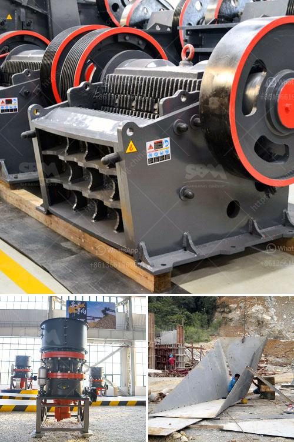

<h3>raymond mill and classifier</h3>
Raymond Mill and classifier are two indispensable pieces of equipment for the processing of non-metallic minerals. Although Raymond Mill has been continuously developed and upgraded in recent years, it still has some deficiencies in terms of classification. In this article, we will elaborate on the advantages and disadvantages of Raymond Mill and classifier, as well as their perfect combination for optimal efficiency in mineral processing.

Raymond Mill is a commonly used grinding equipment, mainly used for non-metallic mineral grinding. Its unique structure and design make it ideal for grinding various minerals such as limestone, calcite, dolomite, barite, talc, calcium carbonate, gypsum, bentonite, etc. In addition, Raymond Mill is also suitable for processing materials with Mohs hardness below 9.3 and humidity below 6%.

One of the advantages of Raymond Mill is its high efficiency in processing fine powder. The fineness of the product is adjustable and can be freely adjusted between 80-325 mesh, which is very convenient for customers to use. It has the characteristics of low energy consumption, high efficiency, small footprint, and low capital investment cost, making it an ideal choice for mineral processing.

However, Raymond Mill has some limitations when it comes to classification. It relies on the airflow to pass through the classifier, which may cause uneven particle size distribution. In addition, the classifier used in Raymond Mill is a centrifugal classifier, which has certain limitations in terms of classification accuracy and efficiency. Although the classifier can control the fineness of the product to a certain extent, it is not ideal for fine classification.

To overcome these limitations, the combination of Raymond Mill and classifier is a perfect solution. By adding a high-precision classifier to the system, the particle size distribution of the product can be better controlled, and the classification efficiency can be significantly improved. This can not only improve the overall quality of the product but also increase the processing capacity and reduce energy consumption.

There are several types of classifiers that can be used in conjunction with Raymond Mill, such as the turbo classifier, wheel classifier, and air classifier. These classifiers use different mechanisms to achieve accurate classification and can be selected according to the specific needs of the mineral processing plant.

In conclusion, Raymond Mill and classifier are essential equipment for the processing of non-metallic minerals. While Raymond Mill excels in grinding efficiency and flexibility, it lacks precision when it comes to classification. By combining Raymond Mill with a high-precision classifier, the deficiencies of both can be compensated, resulting in optimal efficiency and quality in mineral processing. The choice of the classifier depends on the specific needs of the plant, and the combination of Raymond Mill and classifier is undoubtedly an investment that pays off in the long run.
<h3>Contact us</h3><ul><li><strong>Whatsapp:&nbsp;<a href="https://wa.me/8613661969651">+8613661969651</a></strong></li><li><a href="https://swt.shibang-china.com/?git&amp;zhl&amp;raymond mill and classifier"><strong>Online Service(chat now)</strong></a></li></ul><h3>Related</h3><ul><li><a href='jaw crushers zimbabwe.md'>jaw crushers zimbabwe</a></li><li><a href='crusher manufacturer in.md'>crusher manufacturer in</a></li><li><a href='crusher equipment price.md'>crusher equipment price</a></li><li><a href='ball mill ball mill factories.md'>ball mill ball mill factories</a></li><li><a href='tons per year gypsum powder production line.md'>tons per year gypsum powder production line</a></li></ul>