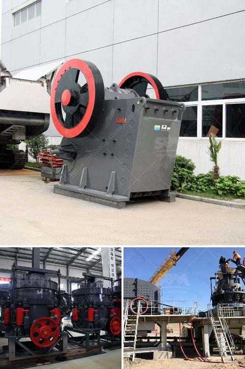

<h3>raymond mill for limestone india supplier</h3>
Limestone is a widely used mineral resource in India. The limestone-rich states of Andhra Pradesh, Karnataka, and Rajasthan are highly sought-after destinations for limestone mining. Raymond mill is a popular choice among the mining industry for its high efficiency, durability, and long service life. In this article, we will discuss Raymond mill for limestone India supplier and why they are a leading choice in the mining industry.

Limestone is a sedimentary rock composed primarily of calcium carbonate. It is widely used in various industries such as cement, construction, agriculture, and chemicals. Raymond mill is a robust machine that is specifically designed to grind limestone to various mesh sizes. This grinding process is suitable for limestone with a Mohs hardness of less than 9 and a humidity level of less than 6%.

One of the primary reasons why Raymond mill is the preferred choice as a limestone grinding mill is its ability to finely crush and grind limestone to desired sizes. With its high-speed rotating blades, Raymond mill can quickly and efficiently reduce limestone particles to smaller sizes. This not only improves the utilization of limestone but also enhances product quality.

Raymond mill offers numerous advantages that make it an ideal choice for limestone grinding. Firstly, the machine has a simple structure, making it easy to operate and maintain. The optimized design of the grinding roller and grinding ring ensures high efficiency and durability.

Another key advantage of Raymond mill for limestone grinding is its high grinding efficiency. The machine can achieve a milling yield of more than 95% for limestone with a fineness of 325 meshes. This high grinding efficiency not only saves time and energy but also reduces production costs.

Moreover, Raymond mill has a long service life, which makes it a cost-effective investment for limestone processing. The grinding roller and grinding ring are made of high-quality materials, which enhances their wear resistance and extends their lifespan. Additionally, the advanced dust removal system effectively reduces pollution and prolongs the service life of the machine.

When it comes to Raymond mill for limestone India supplier, there are several prominent players in the industry. These suppliers offer a wide range of Raymond mills with different specifications to meet various customer requirements. They have a strong technical team that can provide professional guidance and after-sales service.

In conclusion, Raymond mill for limestone grinding is a popular choice in the mining industry. It provides a cost-effective solution for limestone grinding, ensuring high efficiency, durability, and long service life. India has ample limestone resources, making it a lucrative destination for limestone mining. With the availability of reliable Raymond mill suppliers in India, the mining industry can efficiently utilize these resources for various applications.
<h3>Contact us</h3><ul><li><strong>Whatsapp:&nbsp;<a href="https://wa.me/8613661969651">+8613661969651</a></strong></li><li><a href="https://swt.shibang-china.com/?git&amp;zhl&amp;raymond mill for limestone india supplier"><strong>Online Service(chat now)</strong></a></li></ul><h3>Related</h3><ul><li><a href='fine grinding mill specifications.md'>fine grinding mill specifications</a></li><li><a href='kaolin processing equipment.md'>kaolin processing equipment</a></li><li><a href='used ball mills in india.md'>used ball mills in india</a></li><li><a href='ultra fine grinder advantages.md'>ultra fine grinder advantages</a></li><li><a href='ball mill constraction.md'>ball mill constraction</a></li></ul>