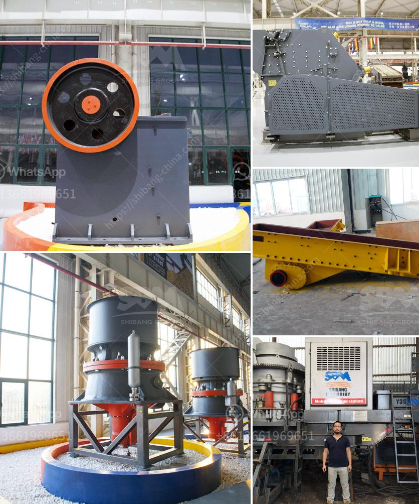

<h3>raymond mills for sale</h3>
Raymond mills are used to pulverize raw materials, calcite, limestone, kaolin, bentonite, marble, gypsum, barite, coal, etc. Due to its wide application range, stable performance, and high efficiency, Raymond mills have been widely used in the grinding industry for many years.

However, as with any industrial equipment, maintenance and upgrading are inevitable, leading to the presence of used Raymond mills in the market. These used mills, also known as refurbished or second-hand mills, offer an alternative solution for industrial prospects looking to acquire a reliable and cost-effective grinding machine.

When it comes to purchasing a used Raymond mill, certain factors need to be taken into consideration. Firstly, it is crucial to understand the condition of the mill and the reason it is being put up for sale. Obtaining a detailed history of the mill, including its usage, maintenance, and any previous repairs, is essential to ensure its functionality and lifespan.

Secondly, the seller's reputation and credibility play a significant role in determining the reliability of the used Raymond mill. Industrial buyers should seek reputable and trustworthy sellers who have a track record of providing high-quality machinery. It is advisable to consult experts or experienced professionals in the field to gain insights and recommendations regarding reputable sellers.

Furthermore, during the evaluation process, prospective buyers should inspect the mill thoroughly. Careful examination of its key components, such as the grinding roller, grinding ring, blade, and other vulnerable parts, is essential. Any signs of wear and tear, corrosion, cracks, or damages should be noted. Additionally, buyers should pay attention to the mill's overall structure, checking for stability and proper functioning of the electrical and mechanical systems.

Moreover, it is highly recommended to test the used Raymond mill before finalizing the purchase. This testing can be performed by running a trial grinding process using a small batch of the desired material. By observing the grinding efficiency, fineness of the output, and the overall performance of the mill, buyers can determine if the mill meets their specific requirements.

Lastly, price negotiation is a vital aspect of the buying process. The price of a used Raymond mill should reflect its condition, age, and the level of maintenance it has received. It is also advisable to compare prices among different sellers to ensure a fair deal. However, buyers should prioritize quality over price, as an inferior mill may result in additional costs due to frequent repairs and reduced efficiency.

In conclusion, used Raymond mills offer a cost-effective solution for industrial prospects looking for reliable grinding equipment. By carefully evaluating the condition and history of the mill, consulting experts, inspecting its components, performing testing, and negotiating the price, buyers can make an informed decision when purchasing a used Raymond mill. With proper maintenance and regular inspections, a used Raymond mill can provide efficient and reliable grinding operations for many years.
<h3>Contact us</h3><ul><li><strong>Whatsapp:&nbsp;<a href="https://wa.me/8613661969651">+8613661969651</a></strong></li><li><a href="https://swt.shibang-china.com/?git&amp;zhl&amp;raymond mills for sale"><strong>Online Service(chat now)</strong></a></li></ul><h3>Related</h3><ul><li><a href='stone quarrying companies in tanzania.md'>stone quarrying companies in tanzania</a></li><li><a href='quarries rock crushing process.md'>quarries rock crushing process</a></li><li><a href='diagram of hammer mill.md'>diagram of hammer mill</a></li><li><a href='cube crushing machine.md'>cube crushing machine</a></li><li><a href='price of roller mill machine.md'>price of roller mill machine</a></li></ul>