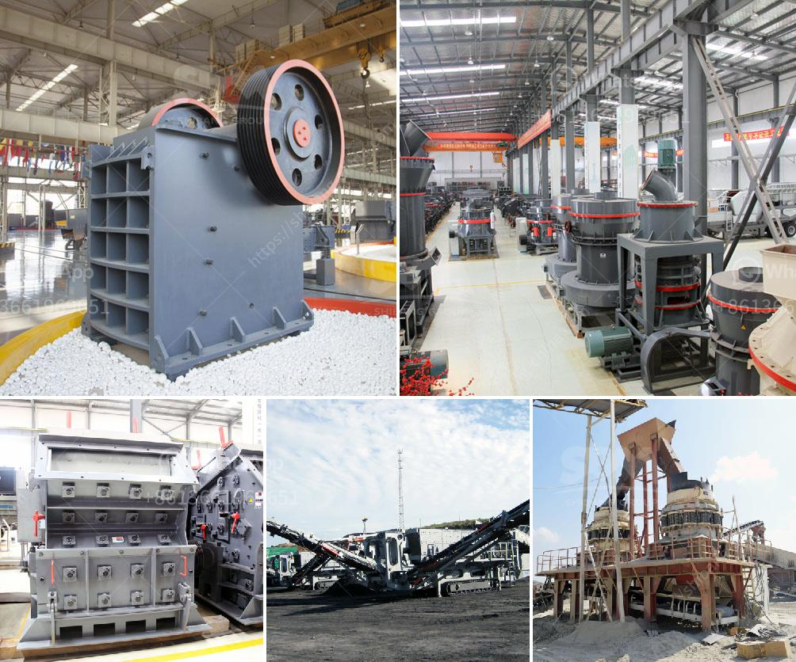

<h3>raymond used mill for sale used</h3>
When it comes to finding affordable industrial machinery, purchasing a used mill can be a smart solution for businesses looking to save costs without compromising on quality. Raymond mills have long been recognized as the gold standard in the milling industry, renowned for their dependability and durability. If you're in search of a Raymond mill for your manufacturing operations, look no further as we explore the advantages of buying a used mill.

Affordability is often the primary reason businesses opt for pre-owned equipment. Used Raymond mills are significantly cheaper compared to brand new ones, offering an attractive investment opportunity for companies looking to expand their production capabilities or replace worn-out machinery. By opting for a used mill, you can potentially save a substantial amount of capital, which could then be utilized for other business needs.

Used Raymond mills are also readily available, with multiple options on the market for those seeking to purchase one. Many reputable dealers specialize in selling previously owned industrial equipment, ensuring you have access to a range of models and specifications to suit your specific milling requirements. Additionally, purchasing from a reliable seller often comes with the added advantage of warranties and after-sales support, providing peace of mind and ensuring your investment is protected.

Opting for a used Raymond mill doesn't mean compromising on quality. These mills are known for their robust construction and dependable performance, meaning that even a pre-owned unit can ensure efficient milling operations for years to come. Moreover, many used mills undergo thorough inspections and refurbishments before being put up for sale, ensuring that they are in optimal working condition.

In conclusion, a used Raymond mill can be a cost-effective and reliable solution for businesses in need of high-quality milling equipment. By choosing a pre-owned unit, companies can unlock the potential of Raymond mills at a fraction of the cost, offering significant savings without sacrificing performance. Just remember to choose a reputable seller that offers warranties and after-sales support to ensure a smooth and successful purchase. So, why not consider a used Raymond mill to elevate your production capabilities without breaking the bank?
<h3>Contact us</h3><ul><li><strong>Whatsapp:&nbsp;<a href="https://wa.me/8613661969651">+8613661969651</a></strong></li><li><a href="https://swt.shibang-china.com/?git&amp;zhl&amp;raymond used mill for sale used"><strong>Online Service(chat now)</strong></a></li></ul><h3>Related</h3><ul><li><a href='impact crushers saudi.md'>impact crushers saudi</a></li><li><a href='crushing plant in pangasinan.md'>crushing plant in pangasinan</a></li><li><a href='superfine grinding mills in shanhgai.md'>superfine grinding mills in shanhgai</a></li><li><a href='stone crusher machine plant for sale in pakistan.md'>stone crusher machine plant for sale in pakistan</a></li><li><a href='frac sand conveyor price.md'>frac sand conveyor price</a></li></ul>