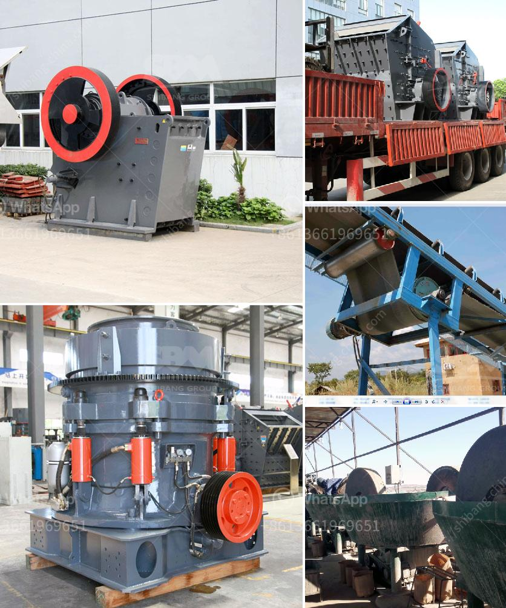

<h3>rental mesin stone crusher</h3>
Are you in the construction industry and looking for a reliable rental mesin stone crusher? Construction projects often require a large amount of aggregate material. The process of crushing these materials is time-consuming and requires heavy machinery. To save time, effort, and resources, rental mesin stone crusher has become a popular option amidst construction companies. This article delves into the benefits of renting a stone crusher and why it is an excellent alternative to purchasing one.

A rental mesin stone crusher refers to a machine that is capable of crushing stones of various sizes into different types of aggregate material. Whether you need crushed stones for building roads, commercial structures, or concrete mixtures, stone crushers are vital equipment in these projects. Renting a stone crusher offers several advantages, especially for smaller-scale construction projects where purchasing equipment might not be cost-effective.

Firstly, renting a stone crusher eliminates the need for substantial upfront investment. Construction companies often face tight budgets and would prefer to allocate funds towards other aspects of the project. By opting for rental mesin stone crusher, you can conserve capital and allocate financial resources more efficiently. The cost of acquiring a stone crusher can be substantial, including the purchase cost, maintenance, and transportation expenses. Renting a stone crusher allows you to avoid these costs.

Secondly, renting a stone crusher ensures that you have access to high-quality equipment. A stone crusher's performance greatly impacts the overall productivity during construction projects. It is essential to choose the right rental company that can provide reliable machinery. Reputable rental companies maintain and service their equipment regularly to ensure optimal performance. This means that you will have access to well-maintained stone crushers that are in good working condition, increasing efficiency during the project.

Thirdly, rental mesin stone crusher offers flexibility. Construction projects often have varying durations, from short-term to long-term. By renting a stone crusher, you can adapt to the specific time frame of your project. Whether you need the equipment for a few days, weeks, or months, rental options are available to suit your needs. This flexibility allows you to avoid any long-term commitment to machinery that might not be needed after the project is completed.

Another advantage of renting a stone crusher is the ease of transport and mobility. Stone crushers are usually heavy-duty machines that require special transportation arrangements. Renting a stone crusher eliminates the need for you to arrange transport for the machinery. The rental company will handle these logistics, ensuring that the stone crusher arrives at your construction site promptly and hassle-free. Additionally, if the project requires multiple locations, rental options can easily accommodate these mobility needs.

In conclusion, rental mesin stone crusher presents an excellent alternative to purchasing a stone crusher for construction projects. Renting allows you to conserve capital, access high-quality equipment, and tailor the rental duration according to your project's requirements. By choosing a reputable rental company, you can have peace of mind knowing that the stone crusher is well-maintained and delivered on time. So, if you're in need of a stone crusher for your construction project, consider the benefits of renting one.
<h3>Contact us</h3><ul><li><strong>Whatsapp:&nbsp;<a href="https://wa.me/8613661969651">+8613661969651</a></strong></li><li><a href="https://swt.shibang-china.com/?git&amp;zhl&amp;rental mesin stone crusher"><strong>Online Service(chat now)</strong></a></li></ul><h3>Related</h3><ul><li><a href='cone crusher deos in mexico.md'>cone crusher deos in mexico</a></li><li><a href='crusher for quick limestone plant.md'>crusher for quick limestone plant</a></li><li><a href='copper ore quarry equipment manufacturer in thailand.md'>copper ore quarry equipment manufacturer in thailand</a></li><li><a href='mica crusher production plants.md'>mica crusher production plants</a></li><li><a href='stone crusher for sale in south philippines.md'>stone crusher for sale in south philippines</a></li></ul>