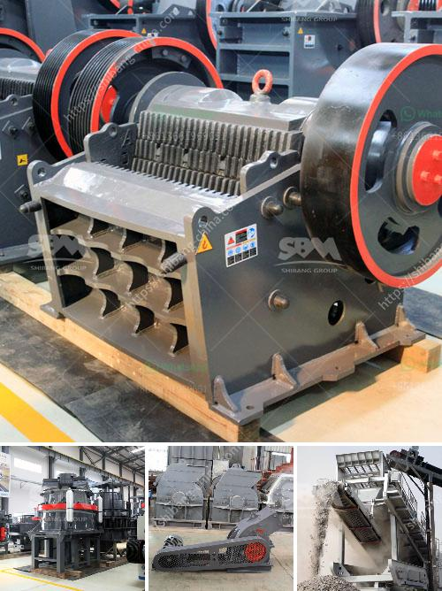

<h3>rental of portable crusher in saudi arabia</h3>
The development of construction industry in Saudi Arabia has been never ending. As a result, the demand for heavy construction machinery such as portable crushers has increased drastically.

Saudi Arabia possesses large deposits of various minerals, including bauxite, copper, gold, iron, lead, silver, tin and non-metallic minerals. Mining crushing plant has wide applications there. The introduction of modern mining and extraction methods has once again made the mine a major producer of precious metals. Exploration projects over the past two decades have unearthed extensive deposits of precious and base metals.

Coal is one of the most important energy, which was widely used in the past. Saudi Arabia's coal consumption begins to increased 30% to 50% by activating seven mines and selecting new partners in the Arabian Gulf. It is reported that there exist many coal reserves in Saudi Arabia. Commonly used type of coal crushing plant in saudi arabia equipment includes jaw crusher, impact crusher, cone crusher, and mobile crusher. However, there are many factors we need to consider when renting portable crusher like climate, location, ore property, portable crusher's components and so on.

Our company must provide the perfect pre-service and after-sales service, to better serve our customers, and ensure the service principle of timely feedback, to make customers at ease. Our rental solutions for crushing plants are designed and adapted for working with all relevant attachments. In existing plants, troubleshooting of the process is essential to increase efficiency and operational stability. Original spare and wear parts from us reliably fulfill the wishes of our customers - quality, high performance and availability.

Renting a portable crusher in Saudi Arabia means dealing with some of the toughest, most demanding operating conditions in the world. However, our company never shies away from challenges and all our equipment is designed to fit perfectly within those harsh environments. We never compromise on quality and always meet customer expectations with our top-of-the-line machinery.

A portable crusher's maintenance and serviceability is crucial in terms of reducing expensive downtime and ensuring that the machines are being utilized to their full potential. Our track record in this regard has been outstanding. Our team of experts is always available to support with any problems or questions you may have. We offer an extensive range of services to support your rental crushers, including delivery and pick-up, equipment training, equipment servicing, and much more.

In conclusion, the rental of portable crushers in Saudi Arabia is a great opportunity for construction companies to operate their projects without purchasing costly machinery. Just get in touch with a reputable and reliable supplier like us to find the exact solution for your needs.
<h3>Contact us</h3><ul><li><strong>Whatsapp:&nbsp;<a href="https://wa.me/8613661969651">+8613661969651</a></strong></li><li><a href="https://swt.shibang-china.com/?git&amp;zhl&amp;rental of portable crusher in saudi arabia"><strong>Online Service(chat now)</strong></a></li></ul><h3>Related</h3><ul><li><a href='stone crusher machine plant for sale in pakistan.md'>stone crusher machine plant for sale in pakistan</a></li><li><a href='granite mining machinery.md'>granite mining machinery</a></li><li><a href='raymond mills for sale.md'>raymond mills for sale</a></li><li><a href='gold wash plant irs california.md'>gold wash plant irs california</a></li><li><a href='copper beneficiation.md'>copper beneficiation</a></li></ul>