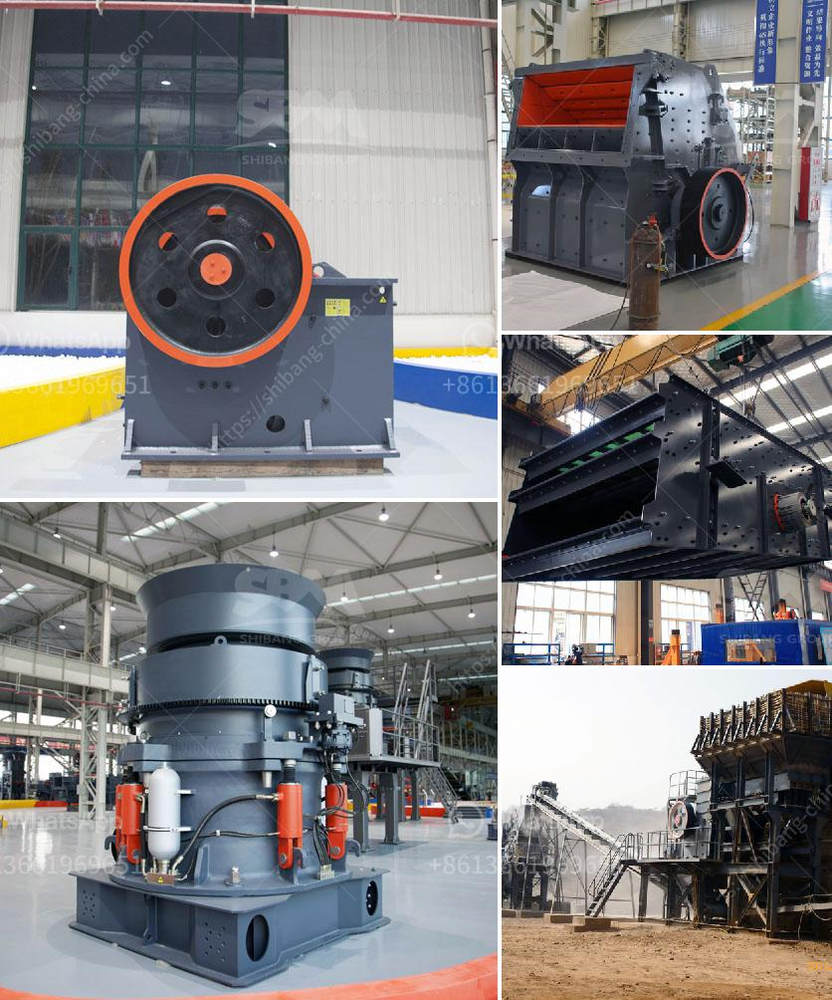

<h3>river pebble crusher</h3>
River pebble is a kind of pure natural stone. It is taken from the sand and gravel hills which were uplifted from the ancient river bed after the crustal movement tens of millions of years ago. It is constantly worn by the flow of the river and transported to the sea, and its size becomes smoother from a variety of different rocks. It is mainly composed of silicon dioxide, and some river pebble crushers are very similar in appearance to pebbles.

The river pebble crusher is often used in various industries such as metallurgy, mining, building materials, highways, railways, water conservancy, and chemical industries. The traditional river pebble crushing process is that after the ore is mined, the large particles of river pebble are sent to the jaw crusher for coarse crushing by the vibrating feeder, mainly for the crushing of large particles. After the coarse crushing of the river pebble, it is sent to the cone crusher for secondary crushing. The processed river pebble has high hardness and wear resistance. In addition, it has a good crushing effect when crushing the medium and fine crushing of river pebbles. The crushing ratio is large and the granularity of the finished product is uniform.

The river pebble crusher is easy to adjust, suitable for medium and fine crushing, and no noise pollution during the operation, which is good for environmental protection. In the river pebble crushing process, jaw crushers are mostly used for coarse crushing and cone crushers are used for medium and fine crushing. Hammer crushers and impact crushers can also be used for secondary crushing.

Cone crushers are widely used in sand production lines. In the process of pebble processing, the choice of cone crusher wear parts is very important. The consumption of wear parts is relatively large. Since river pebbles have high hardness, it is better to use cone crusher. Cone crusher wear parts are made of high-quality manganese steel and are processed by advanced technology. They have the advantages of high wear resistance, strong impact resistance, and long service life. They have a very important influence on the entire production process. The selection of high-quality cone crusher wear parts can effectively reduce maintenance costs and increase production efficiency.

In conclusion, river pebbles are a kind of natural stone with high hardness and good wear resistance. They are widely used in highway construction, infrastructure construction, and other fields. The river pebble crusher is an essential equipment in the sand making process, and it is also an important measure of whether the sand production line is normal or not. It is an ideal equipment for crushing pebbles and is favored by customers. With the continuous development of the mining industry and the continuous advancement of technology, the river pebble crusher will continue to have a broader market prospect.
<h3>Contact us</h3><ul><li><strong>Whatsapp:&nbsp;<a href="https://wa.me/8613661969651">+8613661969651</a></strong></li><li><a href="https://swt.shibang-china.com/?git&amp;zhl&amp;river pebble crusher"><strong>Online Service(chat now)</strong></a></li></ul><h3>Related</h3><ul><li><a href='famous stone crushing equipment supplier in china.md'>famous stone crushing equipment supplier in china</a></li><li><a href='portable concrete milling machines.md'>portable concrete milling machines</a></li><li><a href='crushing and screening companies in south africa.md'>crushing and screening companies in south africa</a></li><li><a href='sale stone quarry crusher plant india.md'>sale stone quarry crusher plant india</a></li><li><a href='mobile crusher in dubai.md'>mobile crusher in dubai</a></li></ul>