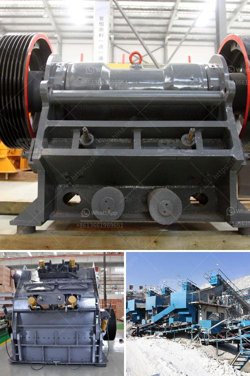

<h3>river sand washing machine</h3>
As the infrastructure construction in various regions intensifies, the demand for fine aggregates and sand in the market continues to increase. River sand, as the main source of construction sand, plays an essential role in ensuring the stability and quality of concrete. However, with the excessive exploitation of river sand, the natural sand resources are rapidly depleted, and the ecological environment is seriously damaged. In response to this situation, the river sand washing machine emerged.

The river sand washing machine, also known as a sand washing machine, is a specific type of sand washing equipment developed by combining advanced technology at home and abroad. It is used for cleaning and removing impurities in sand products, and its final product is fine sand with no impurities. The machine is mainly used for the production of construction sand and is widely used in the construction industry.

The working principle of the river sand washing machine is simple. The impurities in the sand are separated by mechanical force and washed away by water. The cleaned sand is then classified by a spiral or bucket wheel classifier. The washing efficiency of the machine is high, and the sand washer produced by reputable manufacturers usually has a long service life.

The river sand washing machine is suitable for construction sites, sand and gravel plants, hydropower stations, concrete dam sites, post and telecommunications pole factories. The sand washers can be divided into two types: single-screw sand washing machine and double-screw sand washing machine. The former has better cleaning effect and

The river sand washing machine is widely used in various industries such as construction sites, sand and gravel plants, hydropower stations, concrete dam sites, and post and telecommunications pole factories. The sand washing machine can remove impurities such as dust and dirt from sand products. It has a good cleaning effect, high work efficiency, and a wide application range.

The river sand washing machine is equipped with a motor, and the motor drives the impeller to continuously rotate after being decelerated by the V-belt, reducer, and gear. The sand and gravel enter the washing tank, and the impeller rotates to grind the sand, which fundamentally removes impurities. Finally, the clean sand and gravel are taken away by the blades, and the remaining impurities are discharged through the overflow tank, completing the cleaning process.

Compared with traditional manual river sand washing, the river sand washing machine has obvious advantages. Firstly, the river sand washing machine can efficiently remove impurities from sand products. Manual sand washing often cannot remove fine impurities thoroughly, affecting the quality of sand. Secondly, the river sand washing machine has a large processing capacity and can handle a large amount of sand in a short time, improving work efficiency. Thirdly, the machine is easy to operate, saves manpower, and reduces labor costs for enterprises.

In summary, the river sand washing machine is an essential equipment in the sand production line. It can effectively remove impurities in sand products, improve sand quality, and enhance the economic benefits of enterprises. With the increasing demand for sand and the depletion of natural sand resources, the river sand washing machine will play an increasingly important role in the construction industry.
<h3>Contact us</h3><ul><li><strong>Whatsapp:&nbsp;<a href="https://wa.me/8613661969651">+8613661969651</a></strong></li><li><a href="https://swt.shibang-china.com/?git&amp;zhl&amp;river sand washing machine"><strong>Online Service(chat now)</strong></a></li></ul><h3>Related</h3><ul><li><a href='ultrafine pulverizer.md'>ultrafine pulverizer</a></li><li><a href='how much crusher cost.md'>how much crusher cost</a></li><li><a href='turkey gold processing plants.md'>turkey gold processing plants</a></li><li><a href='new technology ball mill factories europe.md'>new technology ball mill factories europe</a></li><li><a href='stone crusher zone in nepal.md'>stone crusher zone in nepal</a></li></ul>