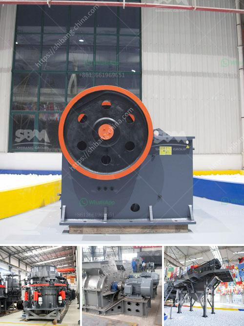

<h3>river stone crusher plant</h3>
River stone crusher plant is a machinery which crushes river stones. The overall performance and structural design make it a popular choice among users. The river stone crushers include: jaw crusher, cone crusher, impact crusher, mobile crusher and VSI sand making machine.

Jaw crusher is generally used for primary crushing in river stone crushing plant. It plays a role of primary crushing process, as well as fine crushing process. The jaw crusher adopts deep V-shaped cavity design with multiple cavities, so that the feeding size and output can be controlled efficiently. Jaw crusher can work independently or together with other devices according to coarse crushing or fine crushing requirements.

Cone crusher is widely used in metallurgical, construction, road building, chemical and phosphate industry. It's suitable for hard and medium-hard rocks and ores, such as iron ore, copper ore, limestone, quartz, granite, basalt, diabase, etc. The crushing cavity type is determined by the usage of ore, such as standard type for medium crushing, medium type for fine crushing, and short head type for super fine crushing.

Impact crusher is suitable for medium and fine crushing of various ore and rock materials, such as limestone, feldspar, calcite, talc, barite, clay, tombar thite, kaolin, gypsum, graphite, etc. The machine adopts high-chromium plate hammer and unique impacting lining board, so that it not only has large crushing ratio, but also has good particle size and high production efficiency.

Mobile crusher is an ideal equipment for crushing construction wastes. Mobile crusher set feeding, crushing, transmission, processing and reprocessing equipment as a whole. It has reasonable construction and high flexibility. In addition, it can be made of different configurations according to customer requirements, so as to achieve more flexible and diverse applications.

VSI sand making machine is a high-efficiency vertical shaft impact crusher, which absorbs German advanced technology and combines with the real situation of domestic sand production lines. It is mainly used for making artificial sand, with advantages of large capacity, grain shape and environmental protection.

In conclusion, river stone crusher plant is widely used in various fields. It can not only crush river rocks, but also artificial sand, construction waste, etc. The river stone crusher plant is stable and reliable, high production efficiency, convenient maintenance, stable operation, low noise and low energy consumption. It has been widely used in water conservancy and hydropower, highway, railway and other industries. The market prospect is broad.
<h3>Contact us</h3><ul><li><strong>Whatsapp:&nbsp;<a href="https://wa.me/8613661969651">+8613661969651</a></strong></li><li><a href="https://swt.shibang-china.com/?git&amp;zhl&amp;river stone crusher plant"><strong>Online Service(chat now)</strong></a></li></ul><h3>Related</h3><ul><li><a href='small scale gold milling and processing plant.md'>small scale gold milling and processing plant</a></li><li><a href='vertical impact crusher.md'>vertical impact crusher</a></li><li><a href='buy stone crushing machine in kenya.md'>buy stone crushing machine in kenya</a></li><li><a href='stone crusher for hire south africa.md'>stone crusher for hire south africa</a></li><li><a href='process flow diagram for kaolin calcining using kiln.md'>process flow diagram for kaolin calcining using kiln</a></li></ul>