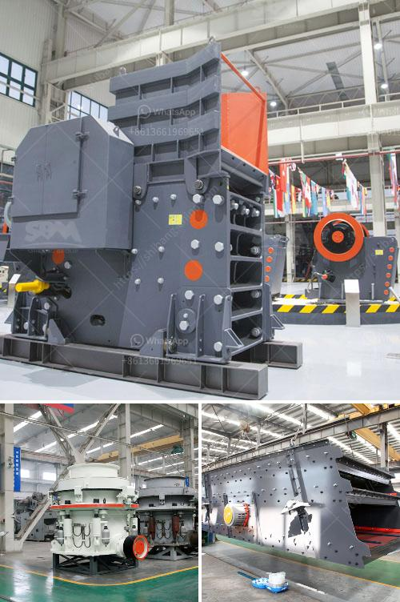

<h3>robinson henry roller mills</h3>
The field of flour milling has come a long way since ancient times, evolving from simple hand-powered stone mills to complex automated roller mills. Among the early pioneers in revolutionizing the flour milling industry is the Robinson Henry Roller Mills, a company that has left an indelible mark on the history of this essential sector.

Established in the late 19th century by two visionaries, Robinson and Henry, the company quickly gained a reputation for its innovative roller mill technology. While stone mills were widely used at the time, they had many shortcomings. They required extensive manual labor, were less efficient in grinding, and produced coarse flour with limited consistency. Moreover, traditional stone mills were prone to contamination and difficult to clean thoroughly.

Recognizing the need for a more efficient, reliable, and hygienic milling solution, Robinson and Henry set out to develop a revolutionary roller mill that would transform the industry. Their invention, known as the Robinson Henry Roller Mill, not only met these requirements but also laid the foundation for modern flour milling technology.

The Robinson Henry Roller Mill consisted of a series of horizontally stacked rollers that applied pressure and friction to grind and crush grains. This innovative approach replaced the traditional grinding stones and significantly improved both the speed and uniformity of the milling process. The use of rollers also facilitated better control over the coarseness of the flour, allowing bakers to produce consistent and high-quality products.

What made the Robinson Henry Roller Mill even more exceptional was its incorporation of advanced technological advancements of the time. The mills were equipped with ingenious sieving and separating mechanisms that efficiently removed impurities and foreign objects from the grains, resulting in cleaner and safer flour. These components were designed to be easily accessible for cleaning and maintenance, addressing the hygiene concerns of traditional stone mills.

The implementation of roller mills not only revolutionized flour milling but also had a transformative impact on the entire baking industry. With the availability of finely ground and standardized flour, bakers could produce more consistent and predictable batches of bread, cakes, and other baked goods. The adoption of roller mills also led to an increase in the production capacity of mills, allowing for larger-scale operations to cater to the growing demand for flour.

The success of the Robinson Henry Roller Mills paved the way for further innovations in flour milling technology. Today, the roller mill remains the cornerstone of modern industrial flour production, with countless advancements and refinements made over the years.

The legacy of Robinson Henry Roller Mills can still be seen in the numerous flour mills around the world that have adopted their revolutionary technology. Their contribution to the industry, marked by superior efficiency, improved hygiene, and consistency, continues to shape the way flour is produced and consumed globally.

In conclusion, the Robinson Henry Roller Mills were pioneers in revolutionizing flour milling technology. Their innovative roller mill design replaced traditional stone mills, offering superior efficiency, improved hygiene, and consistent flour production. This groundbreaking technology not only transformed the flour milling industry but also had a profound impact on the entire baking industry. The legacy of Robinson Henry Roller Mills lives on, as their invention continues to shape modern industrial flour production worldwide.
<h3>Contact us</h3><ul><li><strong>Whatsapp:&nbsp;<a href="https://wa.me/8613661969651">+8613661969651</a></strong></li><li><a href="https://swt.shibang-china.com/?git&amp;zhl&amp;robinson henry roller mills"><strong>Online Service(chat now)</strong></a></li></ul><h3>Related</h3><ul><li><a href='copper concentrate processing equipment.md'>copper concentrate processing equipment</a></li><li><a href='company mobile crushers.md'>company mobile crushers</a></li><li><a href='calcium carbonate milling plant in turkey.md'>calcium carbonate milling plant in turkey</a></li><li><a href='stone crushing plant germany.md'>stone crushing plant germany</a></li><li><a href='small concrete crusher rental nj.md'>small concrete crusher rental nj</a></li></ul>