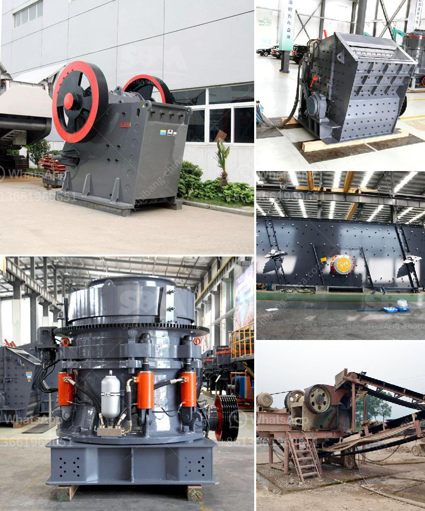

<h3>rock crusher distributors in denver colorado</h3>
Rock crushers are essential machinery in the mining and construction industries. They break down large rocks into smaller, more manageable pieces, making it easier to process materials and extract valuable resources. Distributors play a crucial role in facilitating the delivery of rock crushers to their intended users. In Denver, Colorado, several rock crusher distributors serve the local market, offering high-quality machines and reliable services to meet the demands of various industries.

One notable rock crusher distributor in Denver is Wagner Equipment Co. Serving Colorado since 1976, Wagner is the authorized Cat® dealer for the region, specializing in heavy equipment sales, rentals, and services. They offer a wide range of rock crushers, including jaw crushers, impact crushers, and cone crushers. Wagner also provides support and part sales for all brands they represent, ensuring customers have prompt access to genuine spare parts and expert maintenance.

Another prominent distributor in Denver is Power Screening, LLC. Established in 1984, Power Screening is the authorized Powerscreen® dealer for Colorado and Wyoming. They specialize in the design, sales, and rental of mobile crushing, screening, and conveying equipment. By providing innovative solutions, Power Screening helps companies achieve their production goals and increase overall efficiency. Their inventory of rock crushers features models with various capabilities, from compact to heavy-duty machines suitable for large-scale operations.

In addition to Wagner Equipment Co. and Power Screening, Denver hosts other rock crusher distributors, such as Mellott Company. Founded in 1926, Mellott is a family-owned business dedicated to delivering reliable rock crushing solutions. They offer a wide range of equipment options, including portable crushers, cone crushers, and impact crushers. Mellott also provides comprehensive services, from equipment installation to maintenance and repairs, ensuring customers get optimal performance and longevity from their rock crushers.

The availability of diverse distributors in Denver benefits local businesses in multiple ways. Firstly, various options give customers the freedom to choose the most suitable rock crusher for their specific needs, considering factors such as capacity, mobility, and cost. Secondly, competition among distributors drives innovation and improves the quality of both products and services. This healthy competition fosters development within the industry, ultimately benefiting end-users.

Rock crusher distributors in Denver, Colorado, also contribute to the regional economy by providing employment opportunities and generating revenue. With these distributors, buyers have access to a wide range of rock crushers to fulfill their needs, enhancing productivity and efficiency at construction sites, mines, and quarries. Additionally, the availability of spare parts and maintenance services ensures reduced downtime, minimizing potential losses and optimizing operations.

In conclusion, rock crusher distributors in Denver, Colorado, play a fundamental role in the mining and construction industries. Wagner Equipment Co., Power Screening, LLC, and Mellott Company are just a few prominent distributors providing a wide range of high-quality rock crushers and exceptional customer support. Their presence in the market enhances efficiency, productivity, and economic growth, benefiting both local businesses and end-users.
<h3>Contact us</h3><ul><li><strong>Whatsapp:&nbsp;<a href="https://wa.me/8613661969651">+8613661969651</a></strong></li><li><a href="https://swt.shibang-china.com/?git&amp;zhl&amp;rock crusher distributors in denver colorado"><strong>Online Service(chat now)</strong></a></li></ul><h3>Related</h3><ul><li><a href='hammer mill mining south africa.md'>hammer mill mining south africa</a></li><li><a href='equipment needed for coal mining.md'>equipment needed for coal mining</a></li><li><a href='project report for stone crushing plant.md'>project report for stone crushing plant</a></li><li><a href='rolling ball mills manufacturer.md'>rolling ball mills manufacturer</a></li><li><a href='stone crusher plant for sale philippines.md'>stone crusher plant for sale philippines</a></li></ul>