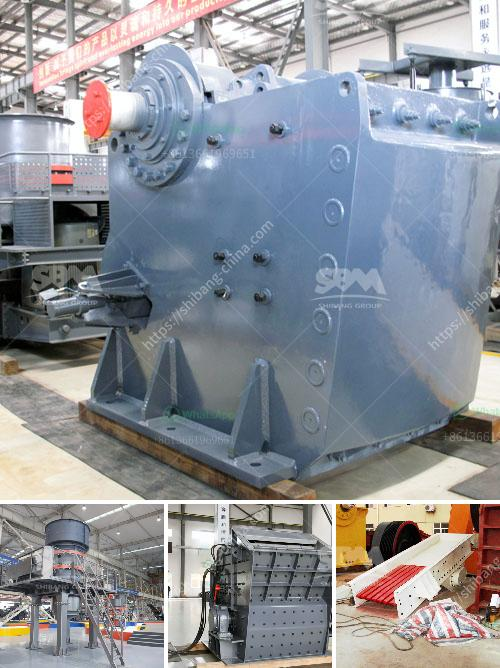

<h3>rock crusher for excavator</h3>
When it comes to construction and demolition work, one of the most critical tools to have in your arsenal is a rock crusher for excavator. These versatile machines can be utilized by construction companies, mining industries, and more. They are essential for efficiently cracking and breaking down large chunks of hard rock materials, such as concrete, asphalt, or stones. With the power of an excavator and a reliable rock crusher, you can transform large rocks into smaller gravels, allowing for easier transportation and disposal.

The primary advantage of using a rock crusher for excavator is its ability to break down large rocks into smaller, more manageable sizes. Instead of relying solely on manual labor and expensive equipment, this machinery can expedite the crushing process and considerably reduce labor costs. With the right attachments and settings, a rock crusher can break down rocks to various sizes, facilitating different applications like road base materials or aggregates for concrete.

Another benefit of utilizing a rock crusher for excavator is its versatility. These machines can be easily attached to the arm or bucket of an excavator, allowing for precise and efficient operations. Whether you need to crush rocks in a quarry, demolish concrete structures, or clean up debris from construction sites, this equipment can be your go-to solution. Moreover, by using different attachments, such as grapples or shears, you can adapt the rock crusher to suit a range of tasks.

Not only does a rock crusher for excavator enhance productivity and efficiency, but it also contributes to environmental sustainability. Instead of sending large chunks of rocks or demolished materials to landfills, this machinery can transform them into reusable materials. By recycling and reusing these materials, you can reduce the demand for natural resources and minimize your ecological footprint.

In conclusion, having a rock crusher for excavator is highly advantageous for construction and demolition sites. Not only does it simplify the crushing process and improve productivity, but it also contributes to sustainable practices by recycling materials. If you are involved in the construction or mining industry, investing in a reliable rock crusher for your excavator can be a game-changer for your operations.
<h3>Contact us</h3><ul><li><strong>Whatsapp:&nbsp;<a href="https://wa.me/8613661969651">+8613661969651</a></strong></li><li><a href="https://swt.shibang-china.com/?git&amp;zhl&amp;rock crusher for excavator"><strong>Online Service(chat now)</strong></a></li></ul><h3>Related</h3><ul><li><a href='conveyor supplier in the philippines.md'>conveyor supplier in the philippines</a></li><li><a href='coal washing plant manufacturers india.md'>coal washing plant manufacturers india</a></li><li><a href='cement clinker manufacturing machine.md'>cement clinker manufacturing machine</a></li><li><a href='suppliers kenya crusher.md'>suppliers kenya crusher</a></li><li><a href='mining equipment for sale in japan.md'>mining equipment for sale in japan</a></li></ul>