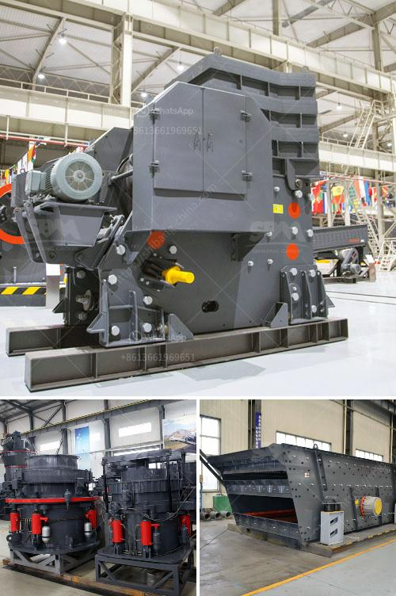

<h3>rock crusher for granite</h3>
Rock crusher for granite, commonly known as stone crusher, is a machine designed to reduce large rocks into smaller rocks, gravel, or rock dust. It is widely used in mining, construction, and recycling industries and can crush a variety of materials including granite, limestone, concrete, and asphalt.

The process of crushing granite involves an initial stage of breaking the large rocks into smaller pieces, known as aggregates. The rocks are typically loaded into a hopper where they are transported to a primary crusher that further breaks them down into smaller pieces. The crushed material is then passed through different screens to obtain the desired size of aggregates.

The rock crusher for granite offers several benefits, such as improved design, enhanced durability, and maximum efficiency. It is equipped with high-quality components and advanced technology that allow it to generate high crushing forces while maintaining low operating costs. This machine can handle even the toughest materials, ensuring a consistent and high-quality product.

One of the key advantages of the rock crusher for granite is its versatility. It can be used to crush various types of rocks, allowing contractors and homeowners to choose the suitable aggregate size for their specific project. Additionally, the machine can be easily transported and operated in different locations, offering flexibility and convenience.

Furthermore, using a rock crusher for granite helps in reducing environmental impact. By reusing and recycling crushed materials, the need for new quarrying operations is minimized, leading to less destruction of natural resources. Additionally, the machine is designed to minimize dust and noise emissions, ensuring a safer and cleaner working environment.

In conclusion, the rock crusher for granite is a versatile and efficient machine that can help improve productivity and reduce environmental impact in mining, construction, and recycling projects. Its durability, design, and advanced technology make it an ideal choice for crushing granite and other tough materials.
<h3>Contact us</h3><ul><li><strong>Whatsapp:&nbsp;<a href="https://wa.me/8613661969651">+8613661969651</a></strong></li><li><a href="https://swt.shibang-china.com/?git&amp;zhl&amp;rock crusher for granite"><strong>Online Service(chat now)</strong></a></li></ul><h3>Related</h3><ul><li><a href='sand stone crusher.md'>sand stone crusher</a></li><li><a href='old cement plant in india for sale.md'>old cement plant in india for sale</a></li><li><a href='quarries rock crushing process.md'>quarries rock crushing process</a></li><li><a href='rental of portable crusher in saudi arabia.md'>rental of portable crusher in saudi arabia</a></li><li><a href='sand dust removal.md'>sand dust removal</a></li></ul>