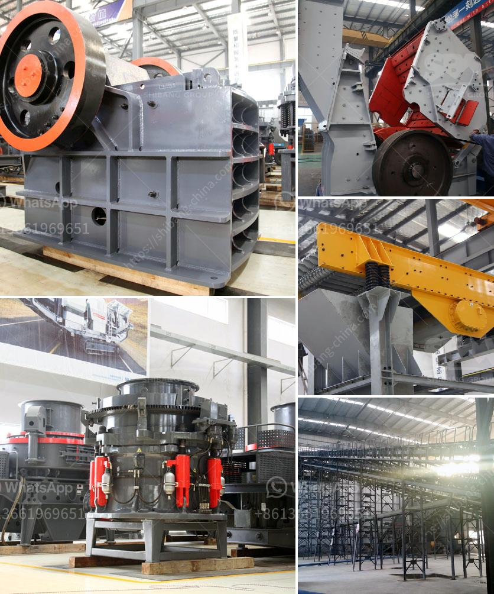

<h3>rock crusher machine cost</h3>
The rock crusher machine cost is an important factor to consider when purchasing equipment for your next project. It is important to understand the different factors that influence the cost of the machine in order to choose the right equipment within your budget. Based on the extensive research on the rock crusher machine cost, it is evident that there are multiple factors affecting the pricing.

One of the primary factors that determine the rock crusher machine cost is the features of the machine. The machine's various features contribute to its overall cost, as each feature requires extra materials and labor during the manufacturing process. For example, a rock crusher with automatic adjustment of the discharge port and overload protection system will generally cost more than a basic machine without these features. Therefore, it is essential to determine which features are necessary for your specific project and budget accordingly.

The design and size of the rock crusher machine also play a crucial role in its cost. A larger machine with a higher crushing capacity will naturally cost more than a smaller one. Additionally, factors such as the type and hardness of the rock being crushed, the required output size, and the expected production volume can also affect the machine's design and size. Thus, it is essential to assess the specific requirements of your project to determine the appropriate machine size, saving you from unnecessary expenses.

Another cost-determining factor is the quality and durability of the machine's components. Generally, machines made with high-quality and durable materials tend to have a higher price. Investing in a rock crusher machine with superior components might initially seem costly but can save you money in the long run. Such machines are less likely to break down, require fewer repairs, and have a longer lifespan than machines with lower-quality components. Therefore, consider the quality and durability of the machine when evaluating its cost.

The source of the rock crusher machine can also affect its price. Machines from reputable manufacturers or suppliers may have a higher cost, considering their reliable reputation and the accompanying warranty or after-sales service they provide. Conversely, machines from lesser-known or non-reputable sources might have a lower initial cost but can be accompanied by potential risks such as poor quality or lack of warranty. It is advisable to research and choose a reliable source that offers a balance between cost and quality to ensure optimal performance and a reasonable return on investment.

Before finalizing the purchase of a rock crusher machine, it is crucial to consider any additional costs that may arise. These additional costs can include transportation fees, customs duties, taxes, installation and commissioning charges, and ongoing maintenance costs. By considering all these factors, you can create a more accurate estimate of the overall cost of the rock crusher machine, allowing you to make an informed decision and avoid any unforeseen expenses.

In conclusion, the rock crusher machine cost is influenced by several factors, including features, design and size, component quality, source, and additional costs. By thoroughly understanding these factors and evaluating your project's requirements, you can create a properly estimated budget for your rock crusher machine purchase. Investing in the right machine within your budget will ultimately lead to higher productivity, efficiency, and satisfaction with your project's outcome.
<h3>Contact us</h3><ul><li><strong>Whatsapp:&nbsp;<a href="https://wa.me/8613661969651">+8613661969651</a></strong></li><li><a href="https://swt.shibang-china.com/?git&amp;zhl&amp;rock crusher machine cost"><strong>Online Service(chat now)</strong></a></li></ul><h3>Related</h3><ul><li><a href='consumption ratio for ball mill.md'>consumption ratio for ball mill</a></li><li><a href='fine powder mill.md'>fine powder mill</a></li><li><a href='used crusher for sale in fujairah.md'>used crusher for sale in fujairah</a></li><li><a href='turkey cement mill plant for sale.md'>turkey cement mill plant for sale</a></li><li><a href='hammer mill manufacturer in tamilnadu.md'>hammer mill manufacturer in tamilnadu</a></li></ul>