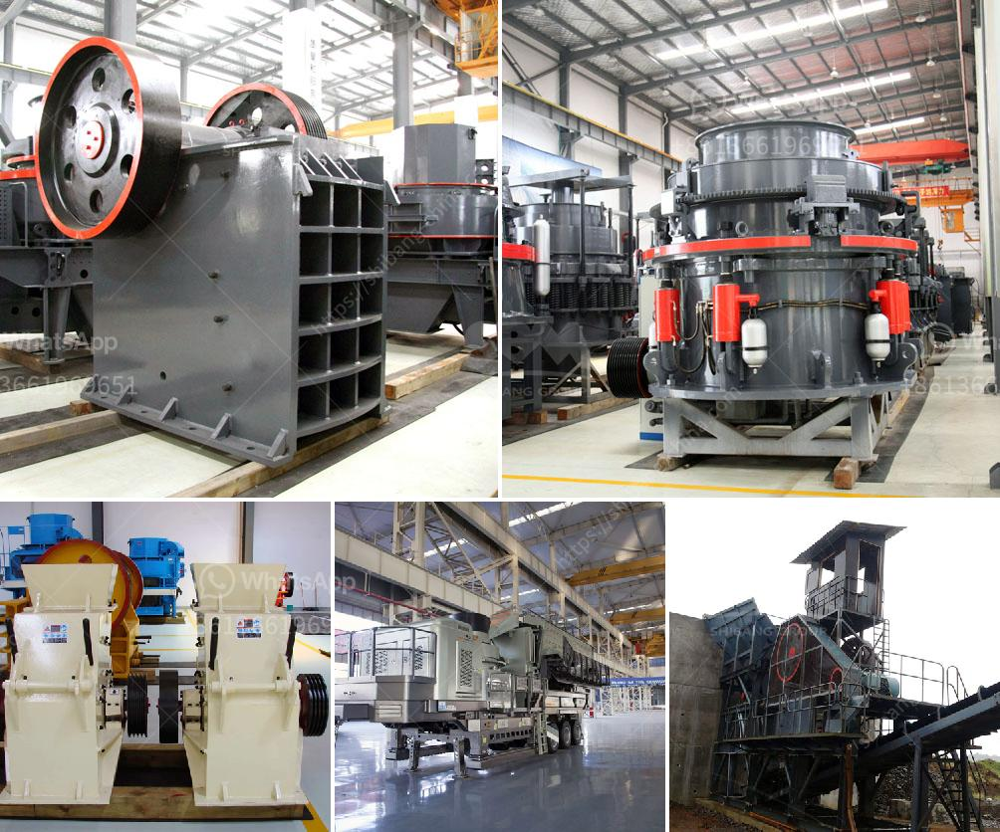

<h3>rock crusher mill</h3>
Mining operations use different kinds of crushers so selecting the appropriate crusher is important for every operation. Understanding the stages of crushing process and the types of crushers that best fit each stage can simplifies your equipment selection. Each type of crusher is different and used to achieve a certain end result.

Similarly, a certain output is expected at the end of each crushing stage of a rock crusher due to which the crushers are categorized into the primary, secondary, tertiary, and fine crusher. The rock crushing process is increasingly demanding in terms of efficiency which puts a huge pressure on the crushers themselves to perform. Crushing rock requires in-depth knowledge and practical experience to recommend the most efficient and cost-effective solutions.

However, there are various types of rock crushers in the market that serve a wide range of purposes. However, the Small Scale Crusher also referred to as the Rock Crusher Mill, is a type of rock crusher. The Rock Crusher Mill has several advantages over other traditional stone crushers in the market due to its high efficiency and energy-saving nature.

Rock crushing is a process that relies on the properties of raw materials and provides various minerals needed in industries such as construction, metallurgy, mines, power plants, etc. The correct combination of crushing equipment is essential to obtain the desired product quality.

A rock crusher mill is a machine used to crush rocks or any other hard and brittle materials, such as ferrous and non-ferrous metals, cement, ore, and coal.

-The primary stage involves breaking down the rock to the desired size. In this stage, rocks are passed through a grid or a vibrating screen for initial sizing.

-The secondary stage involves further crushing of the coarse rocks obtained from the primary stage. This is usually carried out using cone crushers or high-speed impact crushers.

-The final stage is the tertiary crushing stage, where the crushed particles are reduced to the desired size. This stage is typically carried out using vertical shaft impact crushers or gyratory cone crushers.

The Rock Crusher Mill is known for features such as reliability, durability, and high performance. Its compact size, ease of operation, and quick setup times further contribute to its appeal. Additionally, the machine can also cater to various crushing needs, including recycling, demolition, mining, and construction applications.

The Rock Crusher Mill is operated using a motor equipped with a direct start-stop button to ensure maximum simplicity and safety. Its special design allows the equipment to produce a homogenous distribution of particle size, with the smallest possible parts.

In conclusion, the Rock Crusher Mill is a valuable machine that assists in the efficient and profitable production of materials needed for various industries. Whether you are a small-scale miner or a large construction company, the rock crusher mill is an essential addition to your equipment lineup. Its versatility and high performance make it a valuable investment.
<h3>Contact us</h3><ul><li><strong>Whatsapp:&nbsp;<a href="https://wa.me/8613661969651">+8613661969651</a></strong></li><li><a href="https://swt.shibang-china.com/?git&amp;zhl&amp;rock crusher mill"><strong>Online Service(chat now)</strong></a></li></ul><h3>Related</h3><ul><li><a href='uses jaw crusher in kenya.md'>uses jaw crusher in kenya</a></li><li><a href='stone crusher maker in india.md'>stone crusher maker in india</a></li><li><a href='mini robo sand unit price in india.md'>mini robo sand unit price in india</a></li><li><a href='cement plant machinery manufacturers.md'>cement plant machinery manufacturers</a></li><li><a href='business plan and cost for crushing project.md'>business plan and cost for crushing project</a></li></ul>