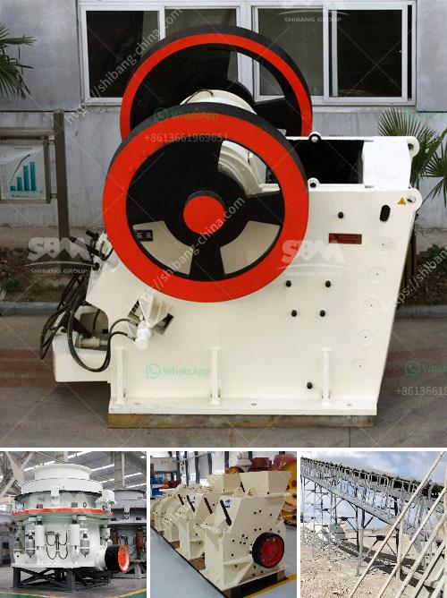

<h3>rock crusher zenith</h3>
The mining industry is evolving at a rapid pace, demanding modern and reliable equipment to meet the ever-increasing needs. Introducing Rock Crusher Zenith, a revolutionary advancement in crushing technology that offers a significant improvement in efficiency, productivity, and profitability for the mining sector.

Rock Crusher Zenith is equipped with state-of-the-art features that allow it to perform at its zenith, leaving competitors lagging behind. With its sturdy construction and heavy-duty components, this rock crusher is built to withstand even the toughest of materials and harshest operating conditions.

One of the standout features of Rock Crusher Zenith is its intelligent controls and automation system. This ensures optimum performance and maximum productivity by constantly monitoring and adjusting the crusher’s operation parameters. This automated system significantly reduces operator errors, minimizing downtime and increasing overall efficiency.

Furthermore, Rock Crusher Zenith boasts a high crushing ratio and excellent particle shape. Its advanced crushing chamber design and optimized eccentricity deliver superior crushing performance, resulting in finer and more uniform finished products. This translates to higher-quality materials and increased profitability for mining operations.

Maintenance is also made easier with Rock Crusher Zenith. The innovative design allows for quick and convenient access to critical components, reducing downtime and streamlining the maintenance process. This means more time spent on production and less time wasted on repairs, ultimately leading to cost savings and improved operational efficiency.

With a wide range of customizable options, Rock Crusher Zenith can be tailored to meet the specific needs of various mining applications. Whether it's crushing hard rock or recycling concrete and asphalt, this versatile machine delivers consistent and reliable performance, proving to be an indispensable asset in any mining operation.

In conclusion, Rock Crusher Zenith sets itself apart from its competitors through its advanced technology, intelligent controls, and industry-leading features. It offers mining operations a cutting-edge solution that not only crushes rock efficiently but also improves productivity and profitability. If you're looking for a rock crusher that surpasses expectations, look no further than Rock Crusher Zenith.
<h3>Contact us</h3><ul><li><strong>Whatsapp:&nbsp;<a href="https://wa.me/8613661969651">+8613661969651</a></strong></li><li><a href="https://swt.shibang-china.com/?git&amp;zhl&amp;rock crusher zenith"><strong>Online Service(chat now)</strong></a></li></ul><h3>Related</h3><ul><li><a href='mobile crushing and screening plants.md'>mobile crushing and screening plants</a></li><li><a href='50tph stone crusher in germany for sale.md'>50tph stone crusher in germany for sale</a></li><li><a href='slinger conveyor belt speed.md'>slinger conveyor belt speed</a></li><li><a href='malaysia heavy industries crushing equipment china.md'>malaysia heavy industries crushing equipment china</a></li><li><a href='dry ball mill in lima peru.md'>dry ball mill in lima peru</a></li></ul>