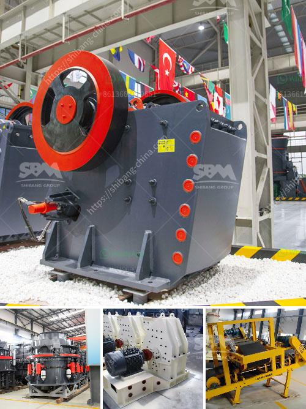

<h3>rock crushers cost tons per hour</h3>
Rock crushing machines are essential in the mining and construction industries. And when it comes to rock crushers, cost is an important factor. Let's delve into the details and consider the variables that can impact the cost per ton of rock crushed.

The number of tons per hour can vary significantly, from as low as 100 tons per hour up to more than 300 tons per hour. It's important to understand the production requirements and select a suitable rock crusher that can handle the desired capacity.

In terms of cost, some of the main factors to consider are the initial investment, maintenance, and operational costs. The initial investment includes the purchase cost of the rock crusher and any accompanying equipment required for its operation. Advanced and sophisticated crushers with higher capacities will generally have a higher purchase cost, whereas simpler and smaller crushers may be more affordable but will have lower production capabilities.

Maintenance costs are another important factor to consider. Crushers need periodic maintenance, including lubrication, part replacement, and general upkeep. The more advanced the rock crusher, the more expensive the maintenance may be.

Operational costs are another aspect to consider. It includes the energy consumption required to power the crusher and any accompanying equipment, such as conveyors or screens. Higher production capacities generally result in higher energy consumption, thus impacting operational costs.

It's also worth considering the potential for downtime due to unexpected breakdowns or repairs. Inefficient or poorly maintained crushers can experience frequent breakdowns, potentially leading to costly delays in production and increased maintenance costs.

Overall, rock crushers can range in cost per ton from relatively affordable to extremely expensive, depending on a variety of factors. It's crucial to conduct thorough research and consider specific project requirements before investing in a rock crusher. Consulting with industry experts or equipment suppliers can provide valuable guidance to ensure the most cost-effective and efficient solution is selected.
<h3>Contact us</h3><ul><li><strong>Whatsapp:&nbsp;<a href="https://wa.me/8613661969651">+8613661969651</a></strong></li><li><a href="https://swt.shibang-china.com/?git&amp;zhl&amp;rock crushers cost tons per hour"><strong>Online Service(chat now)</strong></a></li></ul><h3>Related</h3><ul><li><a href='rock screening plants.md'>rock screening plants</a></li><li><a href='stone crusher baler.md'>stone crusher baler</a></li><li><a href='track mobile crusher.md'>track mobile crusher</a></li><li><a href='portable concrete crusher for rent qatar.md'>portable concrete crusher for rent qatar</a></li><li><a href='bauxite crushing processing equipments.md'>bauxite crushing processing equipments</a></li></ul>