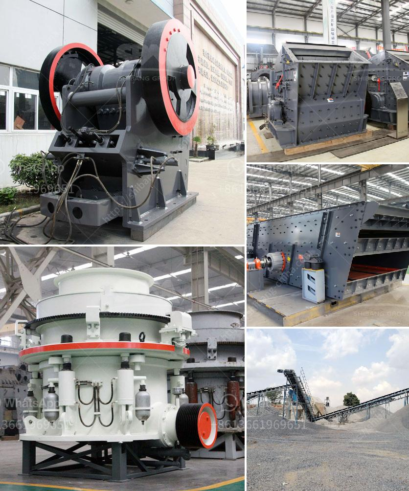

<h3>rock gypsum buyers in china</h3>
Rock gypsum is a valuable mineral that is widely used in various industries, and China is one of the largest buyers of this commodity. With its booming construction and manufacturing sectors, the demand for rock gypsum in China continues to rise, making it a lucrative market for suppliers and exporters.

China's increasing consumption of rock gypsum is primarily driven by its rapid urbanization and infrastructure development. The construction industry in China is known for its extensive use of gypsum in drywall, plaster, and cement manufacturing. The properties of gypsum, such as its fire resistance, sound insulation, and easy workability, have made it an essential material in the construction sector.

Moreover, gypsum is also used in the production of fertilizers, as it contains valuable nutrients like sulfur and calcium. China, being one of the largest agricultural producing countries, has a significant demand for gypsum for agricultural purposes. The application of gypsum in farming helps neutralize soil acidity, improves soil structure, and enhances crop yield.

China's geographical landscape also plays a role in its substantial demand for rock gypsum. The country has a limited natural gypsum reserve, and the quality of its domestic gypsum deposits is often inferior. As a result, China relies heavily on imports to meet its gypsum requirements. The country imports gypsum primarily from countries like the United States, Thailand, Spain, and Canada.

The gypsum market in China is highly competitive, and as a result, Chinese buyers are continuously looking for reliable suppliers that can provide high-quality gypsum at competitive prices. Chinese buyers often prioritize suppliers that have a proven track record of delivering consistent quality and quantity. Additionally, they also consider factors such as reliability, price stability, and reputation when selecting their gypsum suppliers.

In recent years, China has also been implementing stricter environmental regulations, including those related to the gypsum industry. This has put pressure on Chinese buyers to source gypsum from suppliers who comply with environmental standards and practices. Suppliers who can demonstrate sustainable mining and production processes have an advantage in the Chinese market.

To tap into the growing gypsum market in China, suppliers and exporters must invest in building strong relationships with Chinese buyers. This involves understanding the specific requirements and preferences of Chinese buyers, such as product specifications, packaging, and delivery terms. Building trust and credibility in the Chinese market through consistent product quality and reliable supply chain management is crucial for long-term success.

In conclusion, China's rising demand for rock gypsum presents a significant opportunity for suppliers and exporters globally. With its booming construction and manufacturing sectors, China heavily relies on imports to meet its gypsum requirements. However, suppliers must be ready to meet the specific preferences and requirements of Chinese buyers, including adherence to environmental standards. By understanding the market dynamics and building strong relationships, suppliers can successfully cater to the rock gypsum buyers in China and capitalize on the growing demand.
<h3>Contact us</h3><ul><li><strong>Whatsapp:&nbsp;<a href="https://wa.me/8613661969651">+8613661969651</a></strong></li><li><a href="https://swt.shibang-china.com/?git&amp;zhl&amp;rock gypsum buyers in china"><strong>Online Service(chat now)</strong></a></li></ul><h3>Related</h3><ul><li><a href='stone crusher plant cost saudi.md'>stone crusher plant cost saudi</a></li><li><a href='mobile cone crushing station for sale.md'>mobile cone crushing station for sale</a></li><li><a href='raymond used mill for sale used.md'>raymond used mill for sale used</a></li><li><a href='mine to mill optimization and reconciliation.md'>mine to mill optimization and reconciliation</a></li><li><a href='sand conveyor for sale.md'>sand conveyor for sale</a></li></ul>