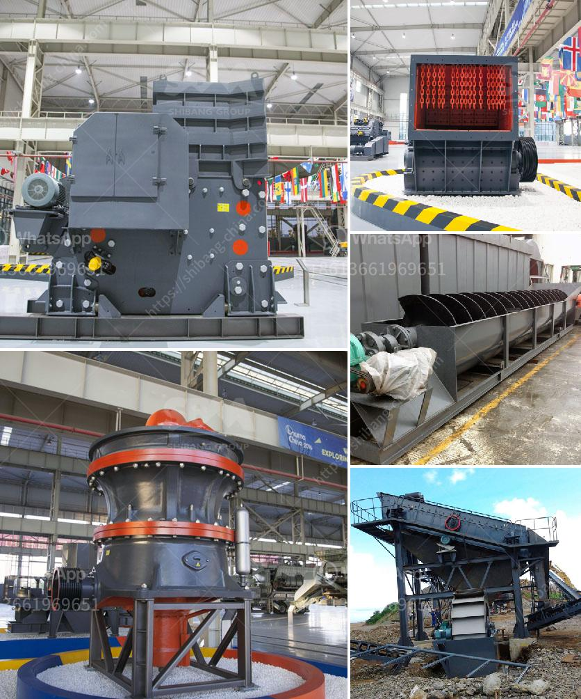

<h3>rock sand machinery india</h3>
Rock sand machinery is an essential equipment for sand screening and processing in India. It is imperative to choose the right piece of machinery for carrying out these tasks as the screeners, loaders, and crushers are the backbone of any successful rock sand production operation.

Rock sand machinery is usually complex and needs specialized knowledge to operate. Furthermore, rock sand machinery often requires hefty investments making it crucial for businesses to select the right equipment in order to maximize their return on investment.

There are several key factors to consider when choosing rock sand machinery in India. Firstly, it is important to assess the material that needs to be processed. Different types of materials require different types of machinery. For example, a crusher specifically designed for basalt may not work efficiently on limestone.

Secondly, it is crucial to evaluate the required output capacity. The machinery should be capable of processing the required amount of material within the desired timeframe. Underestimating the required output capacity may result in production delays and inefficiencies.

Thirdly, rock sand machinery should be durable and reliable. It is important to select machinery from reputable manufacturers that offer warranties and after-sales services. Downtime due to breakdowns can be costly, so investing in reliable machinery is essential for smooth operations and maximum productivity.

In addition to these factors, businesses should also consider the cost of operation and maintenance, energy efficiency, and environmental impact when selecting rock sand machinery. Machinery that consumes excessive energy or produces excessive noise or emissions may not comply with local regulations and could result in fines or penalties.

Fortunately, there are several Indian manufacturers that produce high-quality rock sand machinery. These manufacturers offer a wide range of machines such as crushers, screeners, and loaders, designed specifically for rock sand production. These machines are engineered to deliver high levels of efficiency, durability, and reliability.

Furthermore, Indian manufacturers often offer competitive prices compared to international counterparts. This makes it even more appealing for businesses in India to invest in domestic rock sand machinery. These manufacturers also provide excellent after-sales services including technical support and spare parts, ensuring smooth operations and reducing downtime.

In conclusion, choosing the right rock sand machinery is crucial for successful sand screening and processing operations in India. Businesses should carefully evaluate factors such as material requirements, output capacity, durability, and maintenance costs before making a decision. Additionally, selecting machinery from reputable Indian manufacturers can result in high-quality machines at competitive prices, further enhancing the efficiency and profitability of rock sand production in India.
<h3>Contact us</h3><ul><li><strong>Whatsapp:&nbsp;<a href="https://wa.me/8613661969651">+8613661969651</a></strong></li><li><a href="https://swt.shibang-china.com/?git&amp;zhl&amp;rock sand machinery india"><strong>Online Service(chat now)</strong></a></li></ul><h3>Related</h3><ul><li><a href='fine grinding mill specifications.md'>fine grinding mill specifications</a></li><li><a href='mining machinery companies in germany.md'>mining machinery companies in germany</a></li><li><a href='limestone processing plant.md'>limestone processing plant</a></li><li><a href='ultrafine pulverizer.md'>ultrafine pulverizer</a></li><li><a href='silica sand crusher price in india.md'>silica sand crusher price in india</a></li></ul>