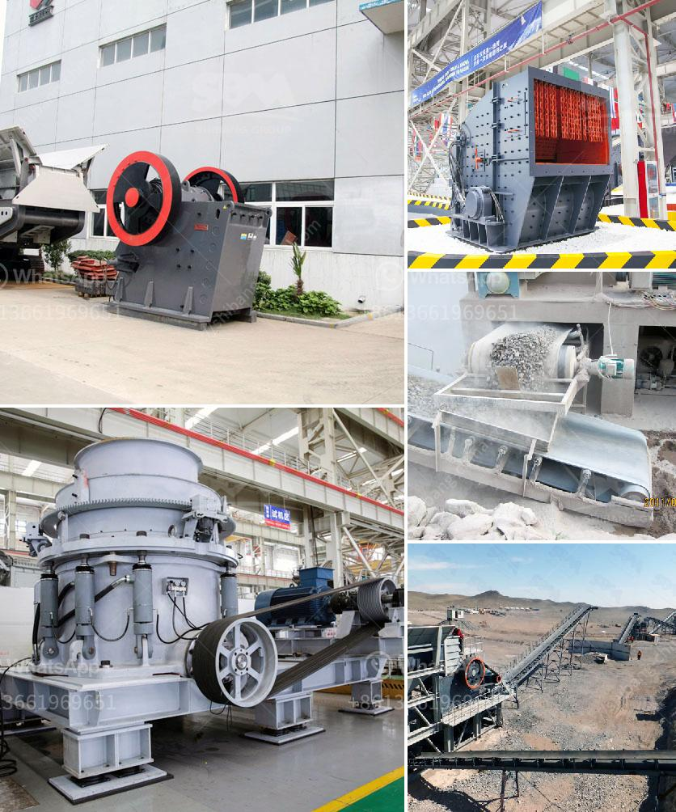

<h3>rock sand plant feasibility report</h3>
Rock sand is a type of sand that is manufactured by crushing rocks into small pieces. It is used in construction as an alternative to natural sand, which can be scarce and expensive. The demand for rock sand has been steadily increasing due to the rapid growth of the construction industry.

A rock sand plant refers to a facility where rocks are crushed into sand particles. This process involves various stages, including crushing, screening, and washing. Once the rocks are crushed, they are then processed to remove impurities and obtain the desired size and shape of the sand particles.

Before setting up a rock sand plant, a feasibility report is essential to assess the viability of the project. This report evaluates the technical, economic, and environmental aspects of establishing such a facility. It helps determine whether the project is financially viable and sustainable in the long run.

The technical feasibility of a rock sand plant is determined by assessing the availability of raw materials, the infrastructure required for the facility, and the technology and machinery needed for the production process. The availability of rocks suitable for crushing is crucial as it directly affects the quantity and quality of the sand produced. Adequate infrastructure, such as suitable land, electricity, and water supply, is also necessary for the smooth operation of the plant. Additionally, the selection of appropriate technology and machinery is essential to ensure efficient and cost-effective production.

The economic feasibility of a rock sand plant involves evaluating the market demand and the potential for profitability. Market research is conducted to understand the demand for rock sand in the region and to identify potential customers, such as construction companies or contractors. The cost of production and the selling price of the sand are compared to determine whether the project can generate a satisfactory return on investment.

Moreover, the environmental feasibility of a rock sand plant is assessed to ensure that the operation does not cause harm to the environment. This includes evaluating the potential impact on air and water quality, land use, and noise pollution. The necessary permits and compliance with environmental regulations are essential to minimize any adverse effects on the surrounding ecosystem.

In conclusion, a rock sand plant feasibility report is crucial for assessing the viability of establishing a facility for producing rock sand. It evaluates the technical, economic, and environmental aspects to determine the project's feasibility and sustainability. A comprehensive assessment of raw material availability, infrastructure requirements, technology and machinery selection, market demand, profitability, and environmental impact is necessary to make informed decisions regarding the establishment of a rock sand plant.
<h3>Contact us</h3><ul><li><strong>Whatsapp:&nbsp;<a href="https://wa.me/8613661969651">+8613661969651</a></strong></li><li><a href="https://swt.shibang-china.com/?git&amp;zhl&amp;rock sand plant feasibility report"><strong>Online Service(chat now)</strong></a></li></ul><h3>Related</h3><ul><li><a href='stone crusher maker in india.md'>stone crusher maker in india</a></li><li><a href='crusher business aggregate.md'>crusher business aggregate</a></li><li><a href='portable crushers for sale.md'>portable crushers for sale</a></li><li><a href='dolomite grinding machine.md'>dolomite grinding machine</a></li><li><a href='small gold ore jaw crushers.md'>small gold ore jaw crushers</a></li></ul>