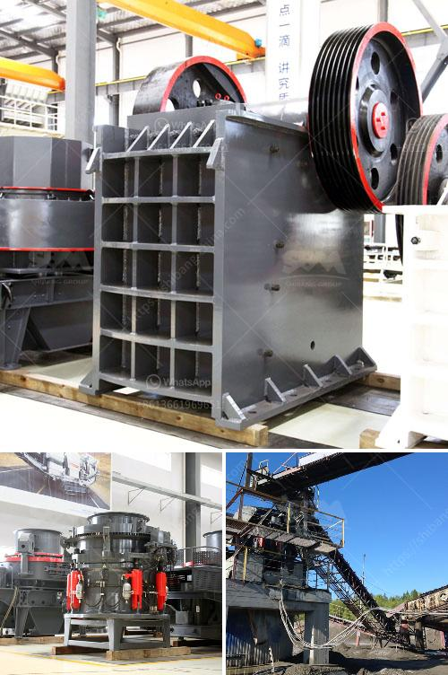

<h3>rock screening plants usa</h3>
Rock screening plants in the USA are becoming increasingly popular due to their efficiency and versatility in the construction and mining industries. These plants, also known as rock crushers or rock separators, are designed to remove unwanted particles or rocks from raw materials, ensuring a higher quality end product.

One of the key advantages of rock screening plants is their ability to handle a wide range of materials. Whether it's gravel, sand, or hard rock, these machines are equipped to handle it all. They are designed to screen and separate different sizes of rocks, allowing for uniformity in the final product. This makes them ideal for use in various applications, including road construction, building foundations, and landscaping projects.

Another benefit of rock screening plants is their mobility. Many plants are designed to be easily transportable, allowing for on-site screening and minimizing the need for material transportation. This not only saves time but also reduces costs associated with transporting materials to off-site facilities for processing.

Furthermore, rock screening plants are equipped with advanced technology and features that ensure efficient operation and minimal downtime. Many plants are automated, allowing for easy control and adjustment of screening parameters. Some models also come with a built-in dust suppression system, which helps to minimize dust emissions during operation, promoting a cleaner and safer work environment.

In terms of maintenance, rock screening plants require regular inspections and servicing to ensure optimal performance. However, the simplicity of their design often makes maintenance straightforward, with many components being easily accessible and replaceable.

In conclusion, rock screening plants in the USA offer numerous advantages for the construction and mining industries. Their versatility, mobility, and advanced features make them an essential tool for processing raw materials and achieving high-quality end products. With their ability to handle a wide range of materials and their ease of maintenance, these plants are becoming increasingly popular in the industry.
<h3>Contact us</h3><ul><li><strong>Whatsapp:&nbsp;<a href="https://wa.me/8613661969651">+8613661969651</a></strong></li><li><a href="https://swt.shibang-china.com/?git&amp;zhl&amp;rock screening plants usa"><strong>Online Service(chat now)</strong></a></li></ul><h3>Related</h3><ul><li><a href='manufactures mineral crusher oruro bolivia.md'>manufactures mineral crusher oruro bolivia</a></li><li><a href='high capacity ball mill malaysia.md'>high capacity ball mill malaysia</a></li><li><a href='quarry equipment and crushers companies in japan.md'>quarry equipment and crushers companies in japan</a></li><li><a href='impact crusher machine price.md'>impact crusher machine price</a></li><li><a href='rock crusher zenith.md'>rock crusher zenith</a></li></ul>