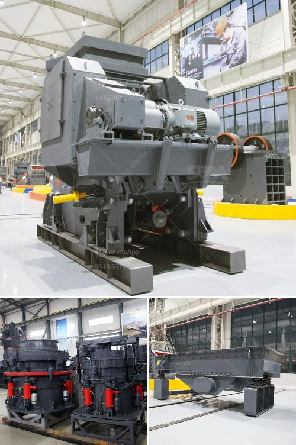

<h3>rock screening plants</h3>
Rock screening plants, also known as rock separators or rock crushers, are machines used to sift rocks and gravel into different sizes. These plants are ideal for construction sites and other areas where large quantities of rocks need to be sorted and processed.

One of the most common uses of rock screening plants is in road construction. When building roads, it is crucial to have rocks and gravel of the right sizes to create a stable and level surface. A rock screening plant makes this process much easier and faster by efficiently separating rocks by size using a series of screens.

Another popular application for rock screening plants is in the mining industry. Mining operations often involve extracting rocks and minerals from the earth's surface or underground. To extract these valuable materials, rocks need to be crushed and screened to various sizes. Rock screening plants help miners accomplish this task more efficiently, saving time and money.

Rock screening plants come in various sizes and configurations. Some are portable and can be easily transported from one job site to another, while others are stationary and designed for more permanent installations. Depending on the specific needs of the project, different types of screens, such as vibrating screens or trommel screens, may be used.

In addition to their efficiency and flexibility, rock screening plants also contribute to environmental sustainability. By separating rocks and gravel from other materials, these plants minimize waste and reduce the need for additional digging and excavation, promoting responsible land use. Their ability to process large quantities of rocks also reduces the need for manual labor, making them a cost-effective solution for many industries.

In conclusion, rock screening plants provide a valuable tool for construction, mining, and other industries that deal with large quantities of rocks and gravel. By efficiently separating these materials into different sizes, these plants help create stable surfaces, extract valuable minerals, and promote environmental sustainability. With their versatility and effectiveness, rock screening plants continue to play a vital role in many sectors.
<h3>Contact us</h3><ul><li><strong>Whatsapp:&nbsp;<a href="https://wa.me/8613661969651">+8613661969651</a></strong></li><li><a href="https://swt.shibang-china.com/?git&amp;zhl&amp;rock screening plants"><strong>Online Service(chat now)</strong></a></li></ul><h3>Related</h3><ul><li><a href='purification process of iron ore.md'>purification process of iron ore</a></li><li><a href='list gold mining equipment and machines.md'>list gold mining equipment and machines</a></li><li><a href='stone crushing production line zenith.md'>stone crushing production line zenith</a></li><li><a href='turkish supplier for phosphate ball mill.md'>turkish supplier for phosphate ball mill</a></li><li><a href='vibratory ball mill china.md'>vibratory ball mill china</a></li></ul>