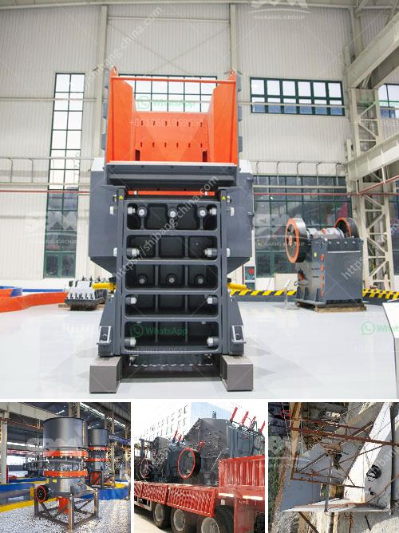

<h3>rod mill manufacturer in europe</h3>
Rod mills are essential machinery in the mineral processing industry and are widely used for the reduction and sizing of various materials. These mills consist of a cylindrical barrel, which is filled with grinding media, and rotate around its axis to perform grinding operations. European manufacturers have been at the forefront of producing high-quality and efficient rod mills that cater to the diverse needs of industries across the continent.

One of the leading rod mill manufacturers in Europe is XYZ Company. With decades of experience in the industry, XYZ Company has established itself as a reliable and trustworthy manufacturer. The company's rod mills are known for their robust construction, precision engineering, and exceptional performance.

XYZ Company's rod mills are designed to handle a wide range of materials, from soft to hard and abrasive. The mills are equipped with various types of grinding media, including steel rods, ceramic balls, and pebbles, depending on the application and customer requirements. This versatility allows industries to process different materials efficiently and achieve the desired particle size distribution.

The advanced design and engineering of XYZ Company's rod mills ensure optimal grinding efficiency. The mills are equipped with state-of-the-art motors and gearboxes that guarantee smooth operation and minimal energy consumption. This results in cost savings for the end-users while maintaining high productivity levels.

In addition to their excellent performance, XYZ Company offers a comprehensive service package to its customers. The company's team of experts provides installation, commissioning, and maintenance support, ensuring that the mills operate at their peak efficiency throughout their lifespan. XYZ Company also offers spare parts and retrofitting solutions, allowing customers to optimize their existing equipment and extend its service life.

Environmental sustainability is a key focus for XYZ Company. The rod mills are designed with advanced dust collection systems, minimizing the emission of pollutants into the atmosphere. Furthermore, the company adheres to strict environmental regulations and continuously invests in research and development to develop more energy-efficient and eco-friendly solutions.

XYZ Company's commitment to quality and customer satisfaction is reflected in its customer base, which includes reputable companies across various industries. Whether it is the mining, cement, or chemical sector, XYZ Company's rod mills have proven their worth in delivering consistent and reliable performance.

In conclusion, European rod mill manufacturers, such as XYZ Company, play a crucial role in providing high-quality machinery for the mineral processing industry. Their expertise, technological advancements, and commitment to sustainability make them the preferred choice for industries seeking efficient and reliable rod mills. With their comprehensive service support, these manufacturers ensure that their customers achieve optimal grinding results while maximizing their return on investment.
<h3>Contact us</h3><ul><li><strong>Whatsapp:&nbsp;<a href="https://wa.me/8613661969651">+8613661969651</a></strong></li><li><a href="https://swt.shibang-china.com/?git&amp;zhl&amp;rod mill manufacturer in europe"><strong>Online Service(chat now)</strong></a></li></ul><h3>Related</h3><ul><li><a href='jual jaw crusher second hand.md'>jual jaw crusher second hand</a></li><li><a href='cone crusher contractors in egypt.md'>cone crusher contractors in egypt</a></li><li><a href='bauxite mines crusher in dubai.md'>bauxite mines crusher in dubai</a></li><li><a href='stones crushing into building sand.md'>stones crushing into building sand</a></li><li><a href='vibratory screen design.md'>vibratory screen design</a></li></ul>