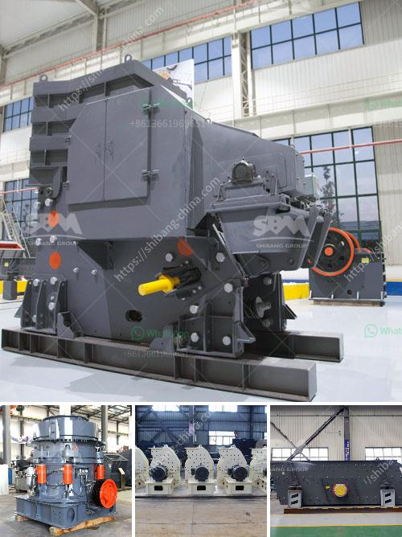

<h3>roller crusher equipment supplier</h3>
Roller crushers are used widely in various industries, including mining and construction. These versatile machines offer excellent size reduction capabilities and are regarded as a vital component in many material processing operations. However, finding the right roller crusher equipment supplier can be an overwhelming task. This article aims to provide insights into the qualities to look for in a roller crusher equipment supplier and highlight the importance of choosing the right partner for your business.

When selecting a roller crusher equipment supplier, reliability and experience are key factors to consider. Look for a supplier with a proven track record and extensive industry experience. A reputable supplier will have a strong reputation for delivering high-quality equipment and providing exceptional customer service. Their expertise will ensure you receive reliable machines that meet your specific requirements.

Considering the demanding nature of material processing operations, the quality of the roller crusher equipment is crucial. A reliable supplier will prioritize manufacturing high-quality machinery built to withstand challenging operating conditions. Ensure that the supplier utilizes premium materials and state-of-the-art manufacturing processes to guarantee the durability and longevity of their equipment.

Every material processing operation is unique, and having roller crusher equipment tailored to your specific needs can significantly enhance productivity. Look for a supplier that offers customization options, allowing you to modify the equipment to fit your specific requirements. Customizations can include adjustable roller gaps, different roller diameters, specific motor power requirements, and other features that enhance operational efficiency.

Investing in roller crusher equipment is not just about the purchase; it is also about post-sales support. Choose a supplier that provides excellent after-sales support, including spare parts availability, maintenance assistance, and technical support. A reliable supplier will have a team of qualified technicians who can provide timely assistance, ensuring minimal downtime and optimal operational performance of your equipment.

Safety should be a top priority when considering roller crusher equipment. A reputable supplier will prioritize compliance with safety regulations, ensuring that their machines are built to meet or exceed industry standards. Safety features such as emergency stops, guards, and proper labeling should be present. Additionally, the supplier should be able to provide documentation attesting to the compliance of their equipment with relevant safety standards.

Selecting the right roller crusher equipment supplier is vital to ensure the success of your material processing operations. Look for a trustworthy supplier with a solid reputation, extensive experience, and a commitment to delivering high-quality equipment. Customization options, after-sales support, and compliance with industry safety standards are also critical factors to consider. By choosing a reliable and competent supplier, you can secure high-performing roller crusher equipment that meets your unique requirements and contributes to your overall operational success.
<h3>Contact us</h3><ul><li><strong>Whatsapp:&nbsp;<a href="https://wa.me/8613661969651">+8613661969651</a></strong></li><li><a href="https://swt.shibang-china.com/?git&amp;zhl&amp;roller crusher equipment supplier"><strong>Online Service(chat now)</strong></a></li></ul><h3>Related</h3><ul><li><a href='jaw crusher pe.md'>jaw crusher pe</a></li><li><a href='famous stone cone crusher for mining industry.md'>famous stone cone crusher for mining industry</a></li><li><a href='tanzania medical equipment supplier.md'>tanzania medical equipment supplier</a></li><li><a href='ballast making machine kenya.md'>ballast making machine kenya</a></li><li><a href='station de concasassage theniet elhad.md'>station de concasassage theniet elhad</a></li></ul>