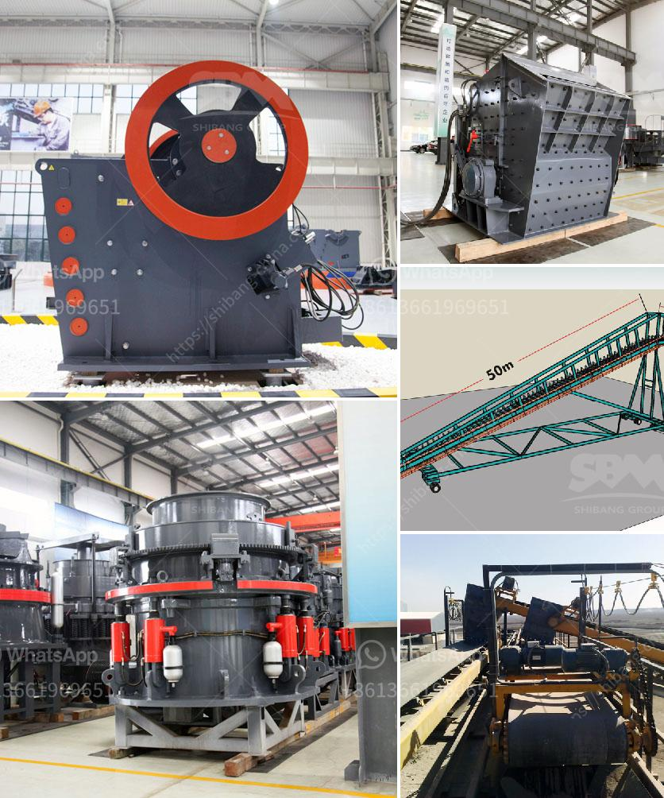

<h3>roller machines for milling</h3>
Milling is a process widely used in various industries, including manufacturing, agriculture, and construction. It involves the removal of unwanted material from a workpiece using a rotating cutting tool. Traditional milling machines have been a staple in workshops and factories for decades, but roller machines for milling are rapidly gaining popularity due to their numerous advantages. In this article, we will explore the benefits and uses of roller machines for milling.

A roller machine for milling is a type of milling machine that utilizes multiple rollers instead of a single cutting tool. These machines consist of two or more cylindrical rollers that rotate in opposite directions, allowing for the simultaneous milling of multiple surfaces. The workpiece is fed between the rollers, which gradually remove the desired material, providing an efficient and precise milling process.

One of the primary advantages of roller machines for milling is their ability to handle larger workpieces and heavier loads. Traditional milling machines often have limitations on the size and weight of the workpiece they can accommodate. Roller machines, on the other hand, can handle larger and more cumbersome workpieces, making them ideal for machining applications that require substantial material removal.

Another benefit of roller machines is their superior surface finish. When using traditional milling machines, the cutting tool may leave behind visible tool marks or irregularities on the workpiece surface. In contrast, roller machines produce a smoother and more uniform finish due to the gradual material removal provided by the rolling action. This makes roller machines particularly suitable for applications where an excellent surface finish is crucial, such as in the production of automotive parts or precision components.

Roller machines for milling are also known for their exceptional accuracy and precision. The multiple rollers work synergistically to ensure consistent and precise milling across the entire workpiece. This level of accuracy can be critical in applications where tight tolerances and dimensional consistency are required.

Furthermore, roller machines offer improved productivity and reduced machining time. Since they can mill multiple surfaces simultaneously, roller machines allow for faster material removal, thereby increasing overall productivity. This efficiency makes them an excellent choice for high-volume production environments, where time-saving is vital.

The uses of roller machines for milling are vast and varied. They are commonly employed in industries such as metalworking, woodworking, and even textiles. Roller milling machines excel at tasks such as surface milling, contouring, grooving, and drilling, among others. Their flexibility and versatility make them an indispensable tool across different sectors.

In conclusion, roller machines for milling are revolutionizing the machining industry with their distinct advantages. From their ability to handle larger workpieces to providing superior surface finish and high precision, roller machines offer a range of benefits for various applications. As technology continues to advance, we can expect further innovations in rollers machines for milling, providing even more efficient and productive milling solutions.
<h3>Contact us</h3><ul><li><strong>Whatsapp:&nbsp;<a href="https://wa.me/8613661969651">+8613661969651</a></strong></li><li><a href="https://swt.shibang-china.com/?git&amp;zhl&amp;roller machines for milling"><strong>Online Service(chat now)</strong></a></li></ul><h3>Related</h3><ul><li><a href='conveyor belt machine.md'>conveyor belt machine</a></li><li><a href='crusher for pozzuolana.md'>crusher for pozzuolana</a></li><li><a href='stone quarry equipment price in ethiopia.md'>stone quarry equipment price in ethiopia</a></li><li><a href='small hammer crusher.md'>small hammer crusher</a></li><li><a href='pulverized ball mill in malaysia.md'>pulverized ball mill in malaysia</a></li></ul>