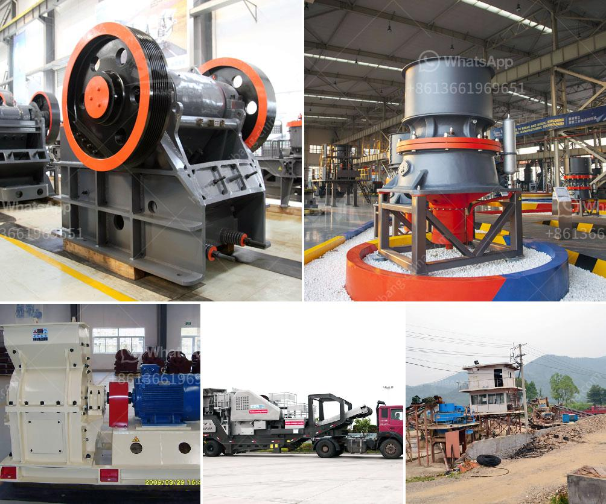

<h3>roller mill for sale kenya</h3>
Roller mills are essential equipment for the milling industry, providing efficient and reliable particle size reduction. They are commonly used in the processing of various grains, cereals, and other agricultural products. In Kenya, where agriculture plays a significant role in the economy, roller mills are in high demand. This article explores the roller mill market in Kenya and highlights the benefits of roller mills for sale in the country.

Roller mills, also known as grain mills or flour mills, are machines that use cylindrical rollers to crush and grind grains into fine flour. They offer several advantages over traditional stone mills and hammer mills commonly used in Kenya. One of the key advantages is their ability to produce a uniform particle size, resulting in a consistent product quality. This is crucial in industries such as bakery, where consistent flour quality is essential for producing high-quality bread and other baked goods.

Another advantage of roller mills is their high efficiency in extracting flour from grains. The roller mill design allows for a greater surface area, enabling the extraction of more flour from each grain. This leads to higher yields and lower production costs for millers. In Kenya, where the cost of production is a significant concern, roller mills provide a cost-effective solution for large-scale grain processing.

Furthermore, roller mills are versatile machines that can handle a wide range of grains and cereals. They can process wheat, maize, barley, oats, and other common crops, making them suitable for various applications. This versatility is particularly valuable in Kenya, where different grains are grown in different regions. With roller mills, millers can easily adjust the machine settings to process different grains, accommodating the diverse agricultural landscape of the country.

In recent years, there has been a growing demand for roller mills in Kenya due to the increasing industrialization of the milling industry. As the country's population continues to grow, so does the demand for processed food products. Roller mills play a crucial role in meeting this demand by providing efficient and high-quality grain processing. As a result, the roller mill market in Kenya has witnessed significant growth, with various manufacturers offering roller mills for sale across the country.

When considering a roller mill for sale in Kenya, there are several factors to consider. Firstly, it is important to choose a reputable manufacturer known for producing high-quality and durable equipment. This ensures the longevity and reliability of the machine, minimizing downtime and maintenance costs. Furthermore, it is crucial to select a roller mill that is suitable for the specific needs and requirements of the business. Considerations such as desired capacity, power requirements, and available space should all be taken into account when selecting a roller mill.

In conclusion, roller mills are a valuable asset in the milling industry in Kenya. With their ability to produce uniform particles, high efficiency, and versatility, roller mills offer numerous benefits over traditional milling equipment. As the demand for processed food products continues to rise, roller mills provide an efficient and cost-effective solution for grain processing. When looking for a roller mill for sale in Kenya, it is crucial to choose a reputable manufacturer and consider the specific needs of the business. By investing in a quality roller mill, businesses can enhance their productivity and profitability in the thriving milling market of Kenya.
<h3>Contact us</h3><ul><li><strong>Whatsapp:&nbsp;<a href="https://wa.me/8613661969651">+8613661969651</a></strong></li><li><a href="https://swt.shibang-china.com/?git&amp;zhl&amp;roller mill for sale kenya"><strong>Online Service(chat now)</strong></a></li></ul><h3>Related</h3><ul><li><a href='coal washing plant indonesia.md'>coal washing plant indonesia</a></li><li><a href='how to calculate grinding media in cement mill.md'>how to calculate grinding media in cement mill</a></li><li><a href='output size of stone crusher machine.md'>output size of stone crusher machine</a></li><li><a href='pulverized ball mill in malaysia.md'>pulverized ball mill in malaysia</a></li><li><a href='superfine grinding mills in shanhgai.md'>superfine grinding mills in shanhgai</a></li></ul>